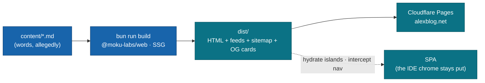

# Geek Life

*A literary, self-ironic dev blog.*
Statically generated, progressively enhanced, and lovingly over-engineered — to render Markdown.

<div align="center">

[](https://github.com/AlexTiTanium/blog/actions/workflows/ci.yml)
[](https://alexblog.net)
[](https://github.com/moku-labs/web)
[](#requirements)
[](#)
[](./LICENSE)

</div>

---

## What this is

A blog with an IDE/terminal aesthetic, written by someone who clearly had other options.

Technically, it's a **Layer-3 consumer app** on [`@moku-labs/web`](https://github.com/moku-labs/web): it calls `createApp`, hands the framework some config and routes. The framework does the heavy lifting. This repo supplies opinions and Markdown.

## Run it

```sh
bun install
bun run dev      # build once, watch content/ + src/, serve http://localhost:4173
```

## How it's built

Markdown goes in. A surprising amount of machinery happens. Static HTML comes out.



The parts worth knowing, briefly:

- **SSG → SPA.** Pages are pre-rendered to static HTML, then the persistent chrome stays mounted while only the `main > section` swaps on client navigation.
- **Two entries, one route table.** `src/app.ts` (Node, the build) opts in the node-only plugins; `src/spa.tsx` (browser) imports from `@moku-labs/web/browser` and omits them, so the client bundle carries no node/native code. A [`bundle-safety`](tests/integration/bundle-safety.test.ts) test fails the build if any sneaks in.
- **No app globals.** Routes and `lib/` helpers never import the concrete app — loaders pull content via `ctx.require(contentPlugin)`, links come from `createUrls(routes)`. (This is what keeps the browser bundle honest.)

## Scripts

| Command | What it does |
|---|---|
| `bun run dev` | Build once, watch `content/` + `src/`, serve `dist/` (rebuild on change) |
| `bun run build` | SSG build → `dist/` (`scripts/build.ts`) |
| `bun run preview` | Serve the built `dist/` (port 4173, Cloudflare-Pages-style clean URLs) |
| `bun run test` | Vitest — unit + integration |
| `bun run test:coverage` | …with coverage (90% gate on `src/lib` + `src/i18n`) |
| `bun run test:e2e` | Playwright — functional + visual baselines |
| `bun run test:e2e:update` | Regenerate visual baselines (macOS) |
| `bun run lint` / `format` | Biome + ESLint / Biome format |
| `bun run deploy` | Cloudflare Pages via `app.cli.deploy()` — guided wizard by default (`--cli` for the headless CI path) |

## Where things live

```
src/
  app.ts          SSG composition — node plugins (content/build/deploy/data/cli); drives scripts/* via app.cli.*
  spa.tsx         Browser boot + client entry (island hydration + intercepted nav)
  routes.tsx      Typed route table (generate / load / render / head / layout)
  config.ts       SITE identity (name, url, author, …) — single source of truth
  i18n/           Locales + UI strings + i18n config
  layouts/        SiteLayout — the persistent page chrome
  pages/          One inner-content component per route
  components/     Preact view components (SSG markup)
  islands/        Vanilla-TS islands hydrated after nav (tab-nav, lang-switcher, …)
  lib/            Pure helpers (articles, content loaders, urls, head, locale, quotes, …)
  og/template.tsx OG card renderer (Satori)
  styles/         CSS entry + tokens + self-hosted @font-face
content/          Markdown articles, per-locale
scripts/          Thin app.cli.* entries: build / serve / preview / deploy
tests/            unit + integration (vitest), e2e (playwright)
```

## Writing a post

One folder per slug, one file per locale, YAML frontmatter on top:

```
content/
  hello-pipeline/
    en.md     # title, date, description, tags, language, author?, draft?
    uk.md     # optional — same slug, another language
```

Set `draft: true` to keep it out of production until it's less embarrassing.

## Deploy

```sh
bun run deploy          # guided setup wizard → Cloudflare Pages
bun run deploy --cli    # non-interactive, headless-safe path
```

## Requirements

- **Node `>= 24`** (the framework's router uses the global `URLPattern`)
- **Bun `>= 1.3.14`**
- **TypeScript** strict mode — `exactOptionalPropertyTypes`, `noUncheckedIndexedAccess`

## Colophon

Words by [Oleksandr Kucherenko](https://github.com/AlexTiTanium). Rendering by [`@moku-labs/web`](https://github.com/moku-labs/web) — which, full disclosure, I also wrote, which is the most on-brand sentence in this file.

Read it (you, specifically) at **[alexblog.net](https://alexblog.net)**.

[MIT](./LICENSE) — the posts are mine, the bugs are collaborative.
