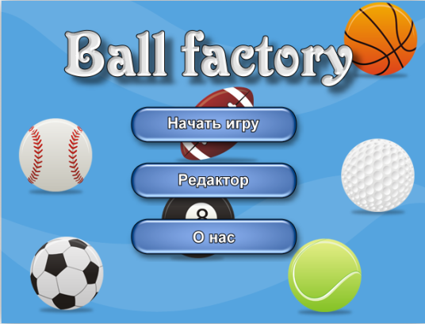
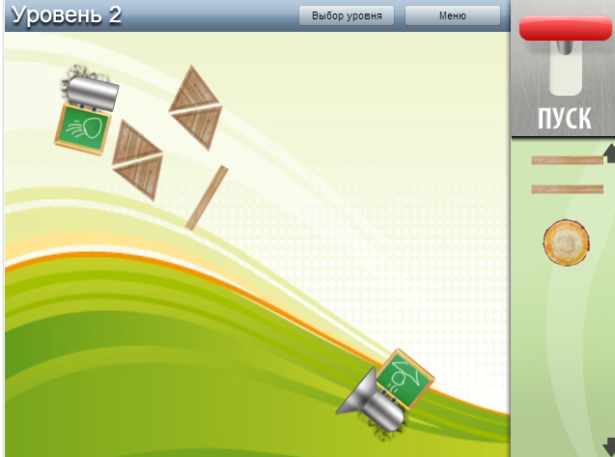
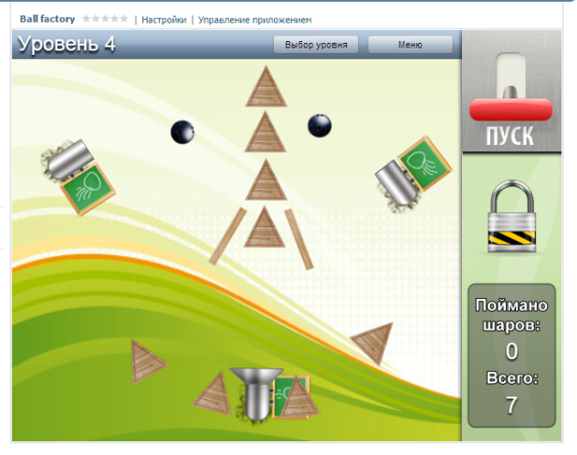
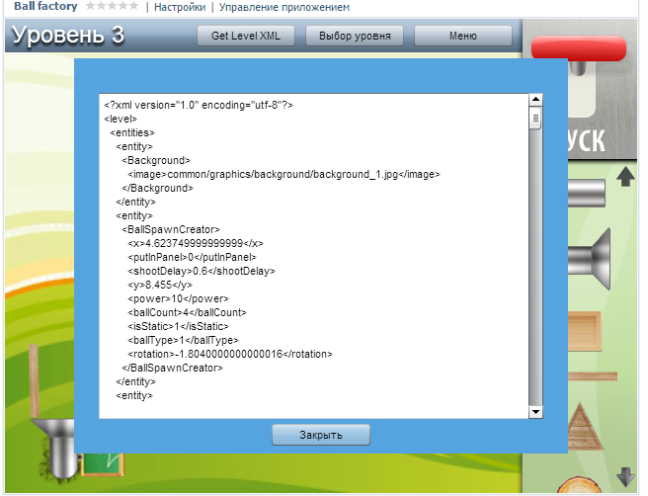
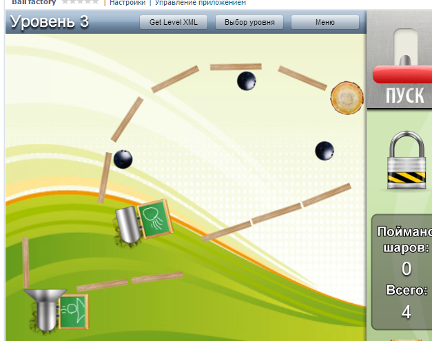
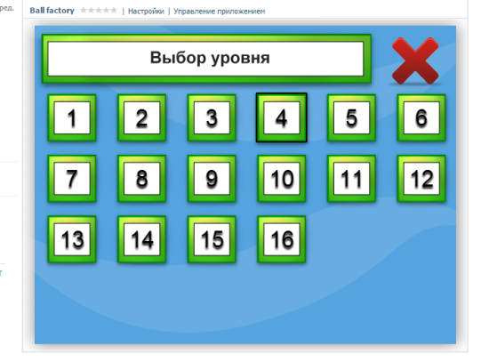

Я не дуже авантюрна людина, але буває. І ось десять днів тому це сталося. Рівно десять днів тому мій товариш Нікіта (який зве себе Division) запропонував взяти участь у конкурсі IGDC.
Ось мої враження…

## Конкурс

Для тих, хто не в курсі: IGDC — це спільнота людей, яким подобається робити ігри. Оголошується конкурс, встановлюються умови — і вперед, узяти участь може кожен охочий. Тема конкурсу, на який я підписався, була справді цікавою: Indirect Control. Суть подібних ігор у відсутності прямого контролю над ігровим процесом. Гравець може впливати на те, що відбувається, лише опосередковано.

Я жодного разу не брав участі в таких конкурсах, на відміну від Нікіти, який навіть посідав призові місця. Ми вирішили писати на ActionScript 3, який я знав вельми приблизно. Чому AS? Просто в Division був движок на AS, що використовував небезвідомий патерн Decorator — і використовував настільки активно, що сам так і називався: Decorator.

Зі словом «indirect» одразу пригадується знаменита головоломка «The Incredible Machine», і мені спала на думку ідея зробити щось схоже, але змінити мету гри. У The Incredible Machine мета — привести механізм у робочий стан, а в нас — змусити всі кульки скотитися в певну трубу, використовуючи всілякі ящики, дощечки і, звісно ж, фізику. На щастя, движок Decorator підтримував Box2D, хоча, дивлячись на розміри першого й другого, незрозуміло, хто кого підтримує. З фізикою все ясно.

Дизайн, хм… ані я, ані тим паче Division малювати не вміли взагалі. Ми вирішили запропонувати почесну посаду дизайнера моєму знайомому. Він намалював пару сцен, але потім у нього щось сталося, і нам довелося малювати самим — а під словом «самим» я маю на увазі себе.

## Розробка

Одна важлива умова конкурсу: гру потрібно зробити за 9 днів. Тож робота закипіла досить жваво. Я вигадував концепт, малював начерки того, що і як має виглядати, а Division готував движок. Для обміну файлами ми використовували Dropbox — і вкотре переконалися, що ця програма незамінна.

Движок готували днів зо три, і це завдання лягло на плечі Division. Але для спільної роботи над проєктом потрібна була програма для контролю версій. Вибір стояв між Git і SVN — ми обрали SVN, про що згодом пошкодували.

Спрацювалися ми досить швидко. Розробка йшла ночами. Оскільки мій досвід у AS лишав бажати кращого, Division по скайпу пояснював мені, що я роблю не так. Скайп, до речі, дуже допоміг нам у проєкті: по-перше, веселіше, а по-друге, ми могли досить швидко координувати свої завдання та дії.

Я з радістю згадую ті безсонні ночі. Було справді цікаво дізнаватися щось нове (AS) прямо в дії. Раніше я вважав, що перш ніж починати писати новою мовою, треба прочитати товстелезну книжку, — як же я помилявся… За ці 4 дні кодингу я дізнався більше, ніж за місяць читання розумної книжки. Звісно, теоретичних знань бракувало, але це швидко виправлялося шляхом набивання гуль на гіркому досвіді…

## Катастрофа з SVN

Десь днів чотири все йшло гладко, мов по маслу, але ось у суботу настав переломний момент. Ми запороли SVN. Ось детальніше, як це сталося… Я відправив новий коміт, Division мав оновити репозиторій… але там стався конфлікт, який потрібно було розв’язати вручну. Через недосвідченість Division натиснув не те або тицьнув не туди — і зрештою запоров один файл. Усі його зміни в цьому файлі було втрачено… І знову ж таки, дурість ніколи не приходить сама… Більше з дурості, ніж з недосвідченості, я порадив йому відкотитися на попередню ревізію, гадаючи, що він робив коміт до цього… Природно, попередня ревізія стерла всю роботу за день… Ми лютували… Здавати роботу треба було вже наступного дня, а ми ще навіть не зробили рівні — і, як на зло, стерлася найважча й найзаплутаніша частина…

Робити нічого — Division довелося все відновлювати. Настрій було підпсовано, але нагорода того варта: ми отримали чудовий редактор рівнів і досить симпатичну гру (дякувати мені за дизайн)…

## Дискваліфікація і порятунок

Закон підлості, акт другий… За правилами конкурсу можна було спізнитися на добу, але зі штрафом 30%, і за умови, що попередиш ведучого конкурсу… Природно, ми не встигали і, звісно, розуміли це й раніше. У відповідній темі форуму IGDC Нікіта висловлював побоювання й припущення, що ми не встигнемо. Ми ще точно не знали, встигнемо чи ні, тож про всяк випадок попередили конкретніше, бо зрозуміли, що раніше наші пости не сприйняли як повідомлення про те, що ми спізнимося. Ведучий сказав: «чого так пізно», але нічого більше. Рівні ми малювали десь до 3-ї ночі (а через 4 години вставати на роботу). Хотіли здати раніше, але, як завжди, ніколи не виходить так, як хочеться. Зрозумівши, що нам світить увесь 30% штраф, ми пішли спати. Удень, у перервах між роботою, я ще доробляв рівні, усував недоліки тощо, готував гру до релізу. І тут, як грім серед ясного неба, нас дискваліфікують… за спізнення… я був, чесно кажучи, в шоці… стільки сил і душі було вкладено, дуже прикро було. Але робити нічого — збираємо архів, відправляємо…

Плентаючись додому, я накупив усілякої гидоти на кшталт чипсів і печива, щоб хоч якось себе втішити. Прийшов і завалився спати, не діставшись навіть до печива й чипсів. Десь о 10-й вечора мене будить дружина з радісною новиною — адмін скасував дискваліфікацію! Радості не було меж. Окрема подяка адміну! Світ знову налагодився… Ми боремося… ми беремо участь… І чекаємо на оцінки…

## Висновки

Які висновки я зробив для себе:
-- Учися на практиці.
-- Робити ігри весело.
-- До біса SVN. Наступний проєкт — на Git.

