Мене питають про це постійно. У найкращі часи моя колекція налічувала [триста з чимось коробок](https://boardgamegeek.com/collection/user/AlexKucherenko), я переграв у багато чого, вже повірте, і питання «а в що пограти, що порадиш?» наздоганяє мене роками. Тож я вирішив зібрати кілька ігор у різних категоріях, які не розчарують.

## Gloomhaven: Jaws of the Lion

[Шедевральний данжен-кравлер](https://boardgamegeek.com/boardgame/291457/gloomhaven-jaws-of-the-lion). За описом гра доволі мудрована, і в неї треба вміти грати, але боже, який там баланс і яка синергія карт у персонажі. Я не знаю, як вони це роблять, але ти виграєш на останній карті, на останньому житті. А якщо програєш, то завжди знаєш, що зробив не так. Маса рівнів, чотири персонажі з прогресією, зручне швидке розкладання, а найголовніше — ціна: п'ятдесят баксів за півсотні годин контенту! Старшого брата на сто двадцять годин і новий Frosthaven, де хрін його знає скільки, не раджу: реалістично у вас немає стільки життя, а у ваших друзів і поготів. За якістю компонентів, геймплеєм, реіграбельністю і ціною цю невелику коробочку, як на мене, ніхто не переплюнув. Абсолютно геніальна гра, дуже раджу. Ми ганяємо її вдвох із дружиною, а от зібрати більший склад уже складніше.

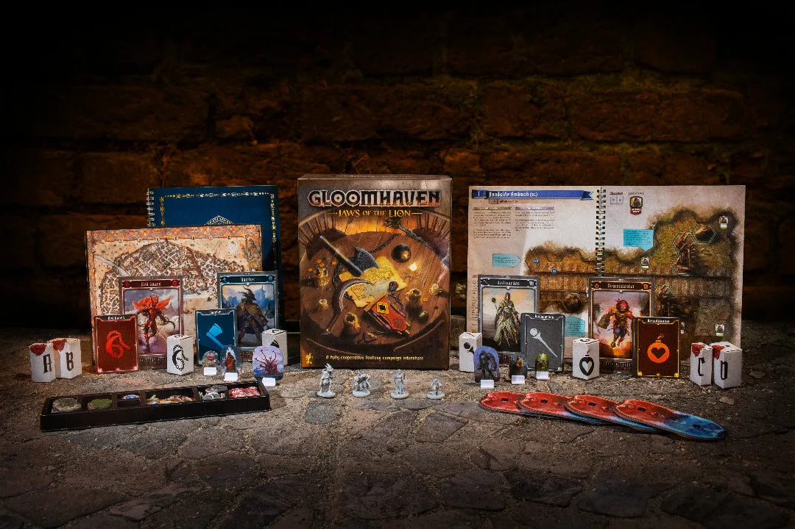

## Тераформування Марса

[Terraforming Mars](https://boardgamegeek.com/boardgame/167791/terraforming-mars) — це щось. Понад двісті карт, просто неймовірні комбінації того, що ти можеш будувати, і партії ніколи не схожі одна на одну. Не знаю, як називається жанр, де в тебе величезна купа карт і ти з випадкової роздачі щоразу намагаєшся вичавити максимум, але кожна партія — це битва з дружиною і щоразу новий досвід. Одразу скажу: у стандартній версії є проблемки з якістю компонентів і планшетами, тож одразу купуйте органайзер і спеціальні планшети. Я ще прикупив металеві кубики, але це вже надмірність. На двох у нашій родині це абсолютний хіт.

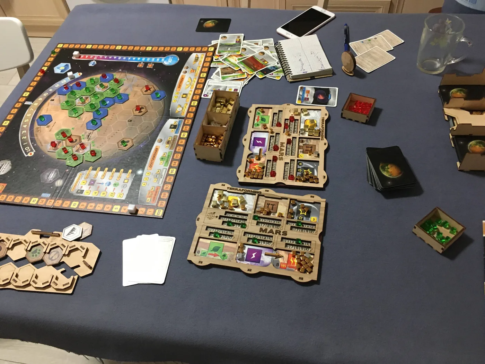
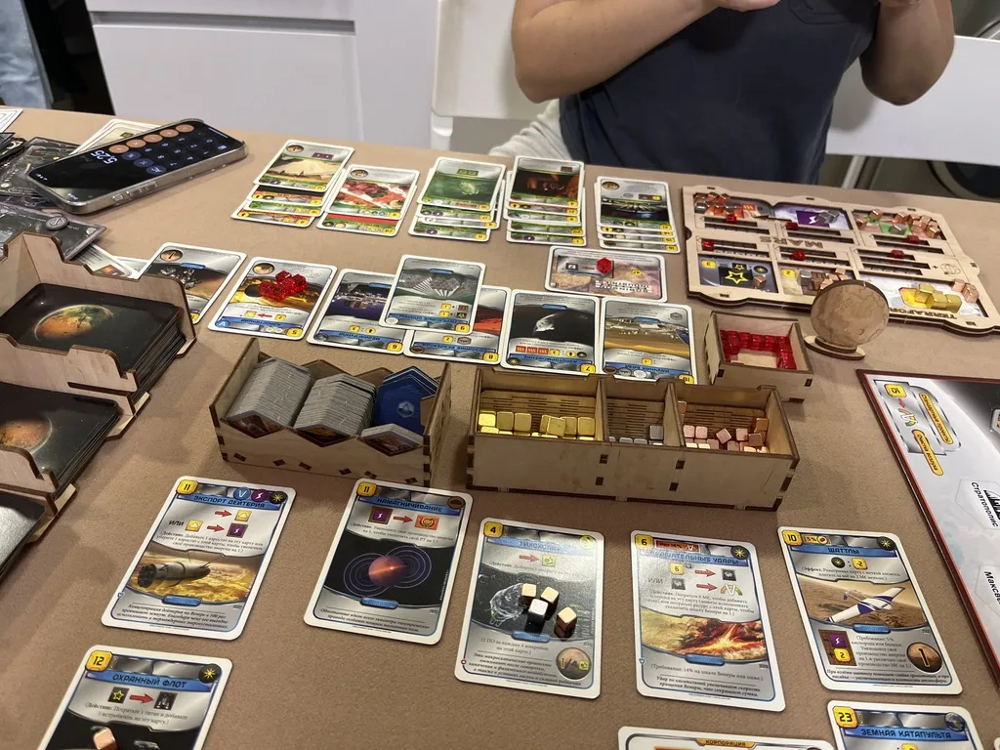

## Кланк!

Серія [Clank!](https://boardgamegeek.com/boardgame/201808/clank-a-deck-building-adventure), від звичайної до легасі: бери будь-яку, не прогадаєш. Дуже проста, дуже весела, найкраще на трьох-п'ятьох. Недовга, якщо не затягувати, і є різні способи кинути друга. Чого ще треба.

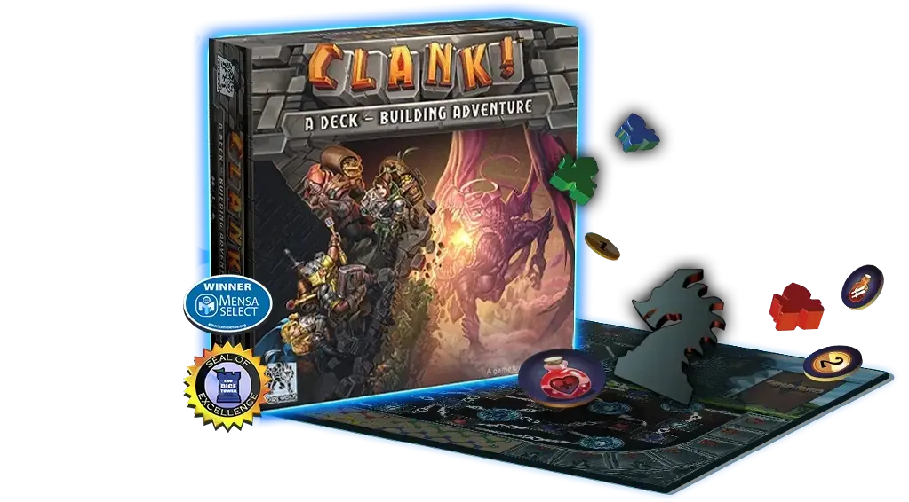

## Detective

Ми з дружиною обожнюємо детективи: «Касл», «Менталіст», «Кістки», «Коломбо» (якщо ви достатньо старі) — все передивлено по двадцять разів. І є настілки, які дають влізти в шкуру цих самих детективів і спробувати розкрити справу. Їх доволі багато, є і складніші, але мені найбільше запам'яталася [Detective: A Modern Crime Board Game](https://boardgamegeek.com/boardgame/223321/detective-a-modern-crime-board-game). Тут потрібен комп'ютер. Гра по суті видає тобі симуляцію поліцейської бази даних і дуже активно використовує інтернет для розв'язання загадок. Більше спойлити не можу, на жаль. У це треба грати самому і насолоджуватися процесом. Не всі справи однаково добрі, але є прямо дуже класні.

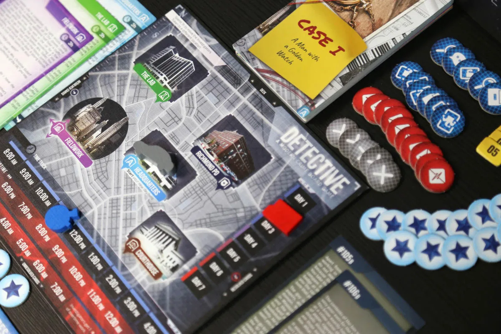

## Unlock!

Квест-кімнати, або ескейп-руми: у це можна грати за столом замість брудних підвалів і секретних кімнат у багатоповерхівках (хто був, той знає). Звісно, дивні кімнати і квартири по-своєму прикольні, там є всякий інтерактив. Але якщо дуже хочеться зіграти вдома, серія [Unlock!](https://boardgamegeek.com/boardgame/213460/unlock-escape-adventures) — наш фаворит: класні логічні квести (привіт, Exit), застосунок, який і підкаже, і зробить гру інтерактивнішою, і щоразу інший стиль і тема: ти прям відчуваєш тему цієї пригоди. Мінус, як і в усіх таких ігор: вони одноразові. Пройшов — і далі продавай, даруй або зберігай, поки не забудеш, що там було.

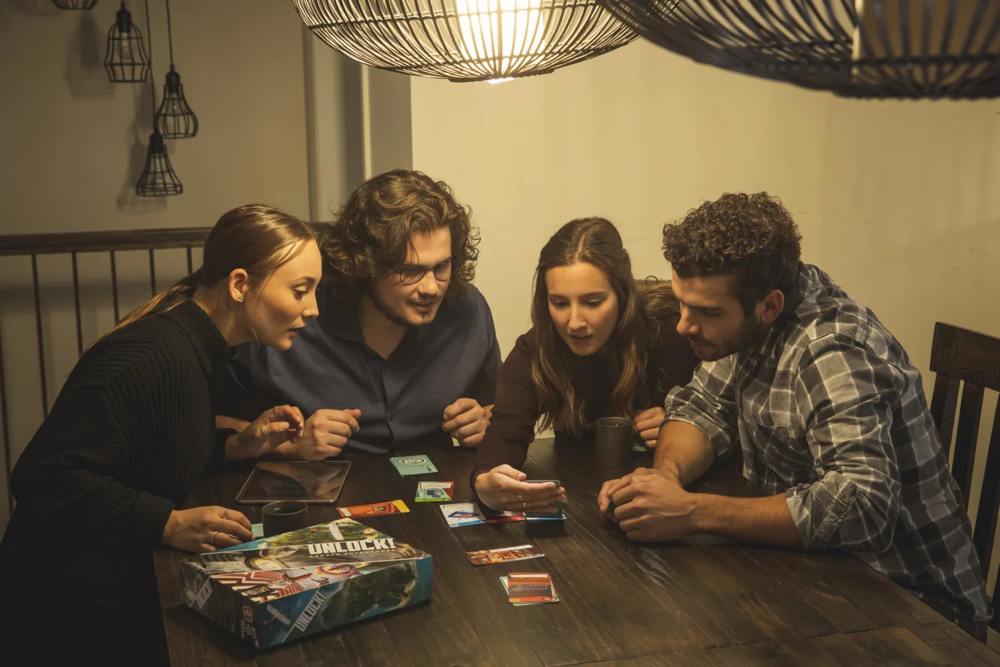

## Brass: Birmingham

Я обожнюю економічні ігри: гроші, доходи, оце все. Але я зневажаю «Монополію»: гру, в якій ти буквально нічого не вирішуєш і від тебе нічого не залежить. Це нонсенс. Як люди з нею носяться і навіщо, я не уявляю. Слава богу, є нормальні ігри, де твої рішення важливі й вирішують результат партії, а найважливіше — впливають на результат партії твоїх опонентів. Серія [Brass](https://boardgamegeek.com/boardgame/224517/brass-birmingham) від Мартіна Воллеса — мій фаворит. Компоненти супер: у делюкс-версії буквально покерні фішки, мапа виглядає просто розкішно, і весь арт дуже стильний. Дуже незвичні механіки (це тобі не кубики жбурляти) і найкласніша модель взаємодії, яку я бачив у таких іграх: усі за столом залежать одне від одного і від рішень одне одного. Я бачив там і всяке кидалово, і просто геніальні ходи, коли ти буквально змушуєш супротивника ходити так, як тобі треба. Тут ніхто не порпається у своєму городі: це прям конкуренція в одній пов'язаній системі. Дуже раджу. Від двох до чотирьох гравців, але на чотирьох найцікавіше.

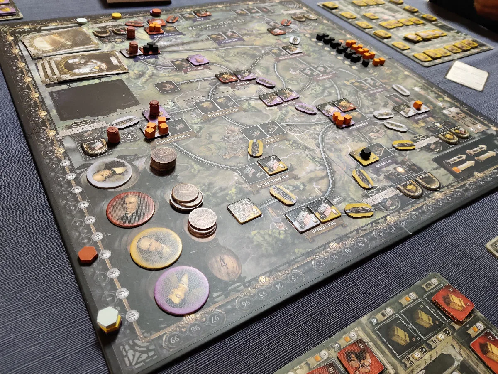

## London

Моя маленька любов, і знову Мартін Воллес, дивись вище. [London](https://boardgamegeek.com/boardgame/236191/london-second-edition) — невелика коробка, але скільки там класних механік. Гра суто карткова: поле є, але воно номінальне. Є, звісно, нюанс. Знаєш колоду добре — і деякі карти явно кращі за інші. Я навіть не уявляю, чому вона мені так подобається, але подобається — хоч убий. Це баланс багатства і бідності, де ти нагрібаєш купу грошей і потім усе зливаєш на інші карти, де ти живеш на межі провалу й успіху. Одне невірне рішення, і тобі тупо кінець. Одне вірне, плюс везіння з картами, і ти на коні. Мабуть, за ці емоції я її і люблю. Суто на двох. І радити не буду: це моя гра, та й хрін ви її зараз знайдете. Але якщо побачите, беріть — не пошкодуєте.

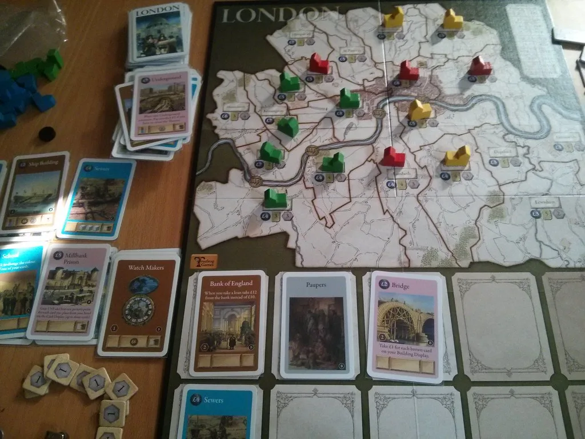

## Крізь віки

Монстр-цивілізація, мама і тато всіх цивілізацій. [Through the Ages](https://boardgamegeek.com/boardgame/182028/through-the-ages-a-new-story-of-civilization) — це мінімум, ще раз, мінімум вісім годин безперервної гри на двох. Утрьох чи вчотирьох навіть не пробуйте: ви її ніколи в житті не закінчите. У грі три невеликі поля, навіть без мапи світу, просто підкладки для гральних карт. І сотні карт: там війна, там мир, там наука і культура. Яким чином це все працює, я не знаю. Але працює. Ви сідаєте з наміром спокійно побудувати цивілізацію з дружиною і подивитися, хто набере більше очок, але все швидко перетворюється на криваве протистояння: вічну загрозу війни, нестачу ресурсів, боротьбу за колонії. І все це на звичайних гральних картах. Як, скажіть мені, як це все працює?! Можу порадити, якщо ви прям задрот. Не просто задрот, а прям той самий нерд, який готовий вісім годин сваритися з другом чи дружиною, і не посваритися остаточно й не розлучитися, коли ця скотина нишком оголошує тобі війну.

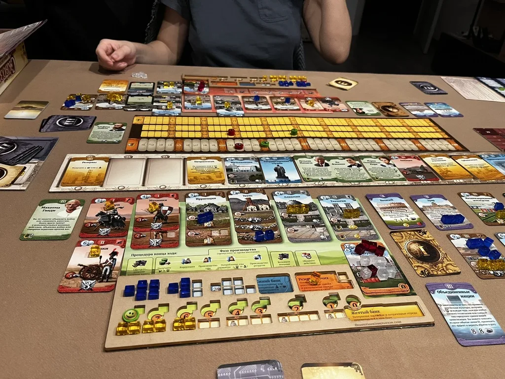
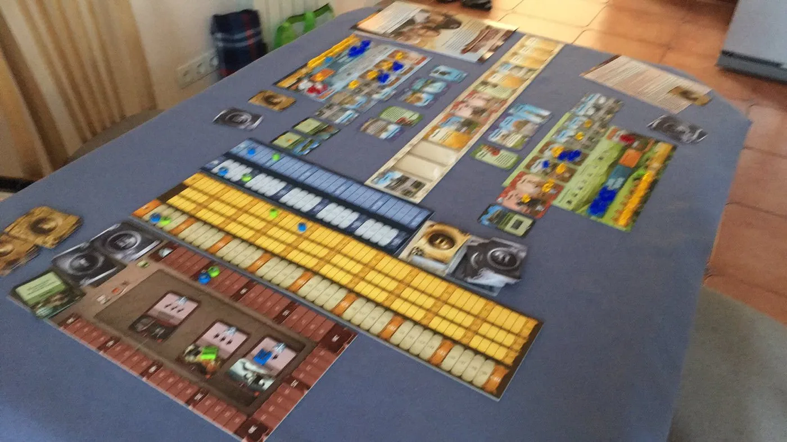
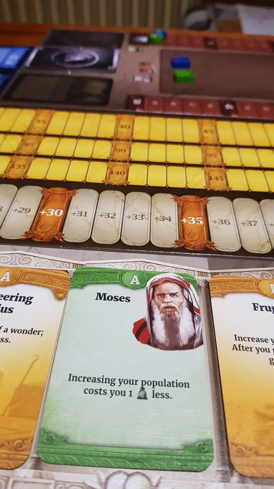

## Mage Knight

Бувають ігри, де механіка краща за саму гру. Колодобудування в [Mage Knight](https://boardgamegeek.com/boardgame/96848/mage-knight-board-game) зроблене абсолютно геніально, але все інше так заплутано, що я не готовий у це грати. Я просто іноді сідаю заради самої колодобудівної системи, заради цієї синергії карт: коли граєш комбо за комбо, коли крутишся як вуж на сковорідці, щоб зіграти ще щось і нанести шкоду якомусь безіменному монстру. За великим рахунком це настільні «Герої»: ти рухаєшся, відкриваєш тайл, наймаєш загони, вбиваєш монстрів — усе, більше нічого немає. Я можу годинами критикувати цю гру: наскільки вона заплутана, які там нудні місії, які незрозумілі рандомні монстри. Але боже, до чого ж там класні механіки карт. Ех, якби була опція отримати цю механіку в якійсь іншій обгортці.

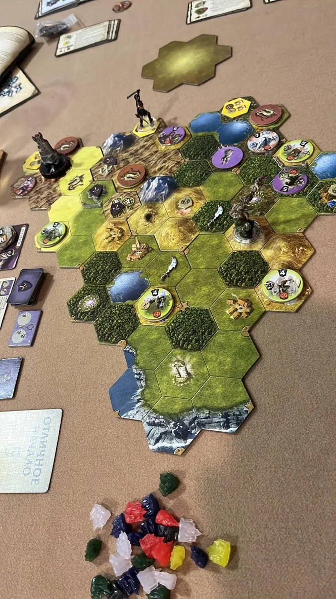
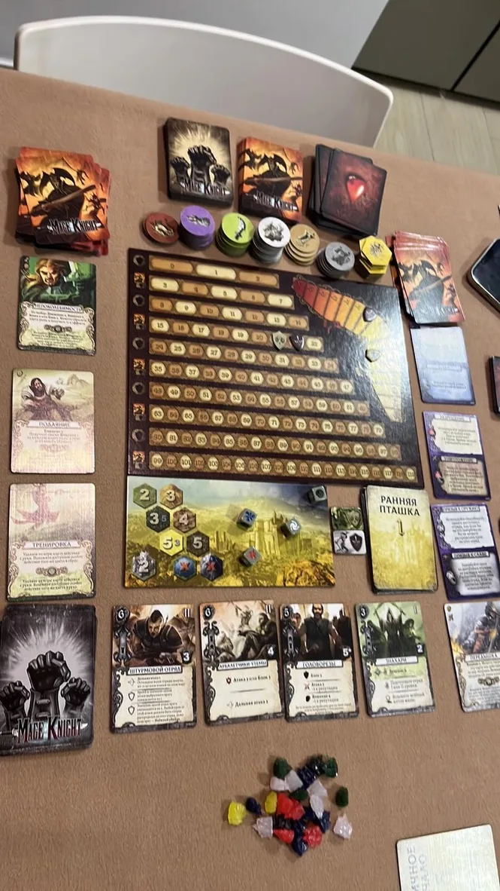
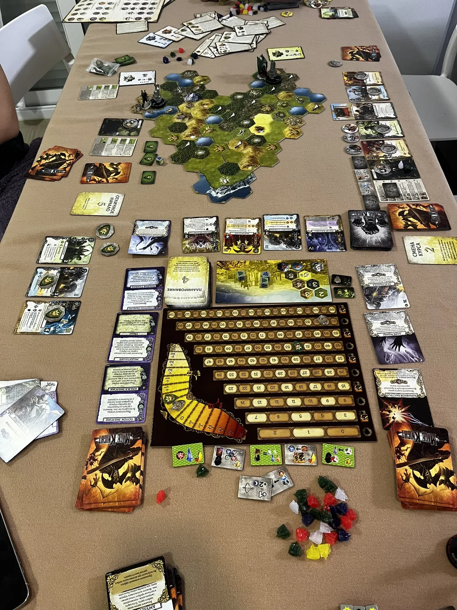

## Алхіміки

Є така штука: головоломка. Уявіть, що ви розв'язуєте головоломку, поки граєте в настільну гру: це і будуть [«Алхіміки»](https://boardgamegeek.com/boardgame/161970/alchemists). У складнішу гру я не грав — і не тому, що правила тут складні. Суть у тому, що тобі треба розв'язати щось типу судоку-пазла і при цьому ще якось грати в гру. Розв'язок, навіть частковий, треба вплітати у свою партію: публікувати теорії, спростовувати публікації суперника і навіть свої, йти на ризик, вгадувати, використовувати опонента, щоб добути ще більше інформації для пазла. Щоб потім дізнатися, що ти помилився і розв'язав усе неправильно — і при цьому виграти. Це все «Алхіміки».

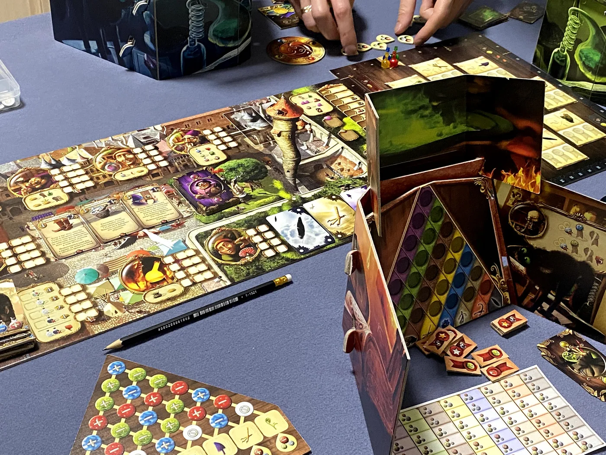
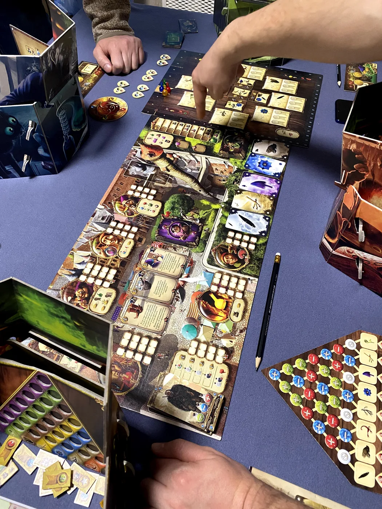

## Cosmic Encounter

Існує купа соціальних ігор: усілякі мафії, диксити, імеджинаріуми, коднеймси. У них цікаво грати пару партій, потім усе починає приїдатися: емоції отримати можна, але механічно це таке собі. І є одна гра, яка просто рве ці ваші мафії і диксити на одному диханні. Такого рівня кидалова, як у [Cosmic Encounter](https://boardgamegeek.com/boardgame/39463/cosmic-encounter), ви у своєму житті не бачили і не відчували. У коробці п'ятдесят персонажів, які зламані від початку до кінця. Є ті, хто міняється з вами картами. Є ті, хто може подивитися бойову карту, від якої залежить хід битви. Є навіть персонаж Наречена, яка обирає собі чоловіка і може дивитися його карти, чоловік не може її атакувати, а коли вона розлучається, то забирає половину його карт. Ви собі можете уявити рівень божевілля за столом із такими персонажами? Хто не грав — не зрозуміє, а хто грав, уже розуміє, про що я. Ця гра знищила для мене всі соціальні ігри: планка веселощів задерта так високо, що ніхто навіть близько не валяється.

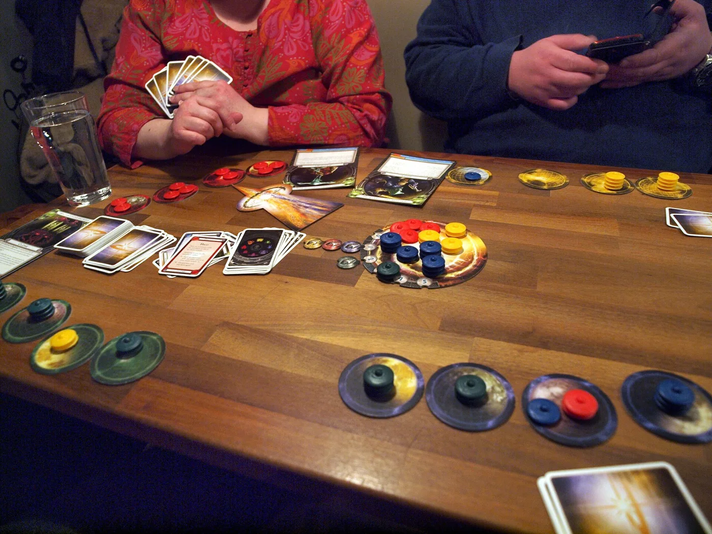

---

Ось така от добірочка від мене. Не нудьгуйте.

*Фото: [El Pantera](https://commons.wikimedia.org/wiki/File:Playing_board_game_-_Play_1048_1724352635173.jpg), [wetwebwork](https://www.flickr.com/photos/wetwebwork/14291336656), [JIP](https://commons.wikimedia.org/wiki/File:Cosmic_Encounter.jpg) · CC BY-SA / CC BY. Промо-фото: © [Cephalofair Games](https://cephalofair.com/products/gloomhaven-jaws-of-the-lion), [Dire Wolf Digital](https://www.direwolfdigital.com/clank/), [Portal Games](https://en.portalgames.pl/detective-photo-gallery/), [Space Cowboys](https://www.spacecowboys-games.com/game/unlock/). Решта фото мої.*
