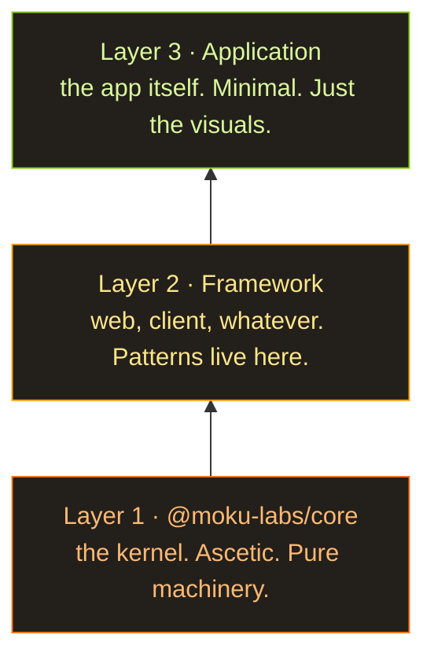

The moment the models got even slightly smarter, everyone had the same thought at once: what if I could just generate the software I need and not pay a single cent to those programmers of yours? You tell the model: I want a blog engine. Make it beautiful, the fastest, the best, not a single bug — or you're going to jail. And three hours later, for a twenty-dollar subscription, you have everything you asked for. With zero mental effort on your end. You fire off a prompt and go re-watch old seasons of *House* — it feels new, because nothing interesting has shipped in about ten years anyway.

And of course, the moment that idea landed, everyone started bolting on clever little plugins, skills, call them what you like, anything to make the prompt behave, and behave long enough to deliver. There will be stages. There will be a review of every stage of the project. GSD was the first of these I tried, and I was genuinely stunned: it created the appearance of serious engineering. Then came a thousand more equally clever schemes for manufacturing activity and the feeling that the software you ordered is *almost* here. You have a plan. You have a spec. Everything is under control. The thing is so easy to drive that I sat my wife down in front of it, and she had no trouble at all; she only called me over to answer the technical questions. Tell me that's not a fairy tale.

## Not quite a fairy tale

The idea is genius from every angle: pennies in, everything you ever wanted out, all rosy.

...Well. Not quite. And not so rosy. What you actually get goes more like this: it'll probably even boot, but the bug count will be spectacular. You'll debug till you're blue in the face, fixing it through the AI, naturally, and what you end up with is a hundred spaghetti functions. It sort of works, but at any given moment something somewhere is broken, visually or invisibly, and working out what's actually going on is no longer humanly possible.

And none of the generated stuff, I noticed, has a unifying concept. No idea of how the whole thing hangs together. Everything touches everything, every API gets yanked from everywhere, state gets dumped wherever it happened to land. That is not how you build software. Okay, fine, it is, people do. But if you want something that works *and* can be maintained and extended later, you need an idea of the architecture. A simple one, like a tree. Because the AI isn't fond of following instructions, so the architecture has to be obvious. To the human and to the machine.

## So Moku Core was born

A system of plugins that together assemble an application. Each piece lives isolated inside its own plugin. What goes in and how it's configured is the entry point's call. How a plugin works on the inside is nobody's business, as long as it works and honours its contract.

```typescript
// A plugin is one self-contained contract: its config, its state, and the API it hands out.
export const routerPlugin = createPlugin("router", {

  // config — the defaults; every key becomes optional for whoever uses the plugin.
  config: { basePath: "/", notFoundRedirect: "/404" },

  // createState — private mutable state, owned by this plugin and nobody else.
  createState: () => ({ currentPath: "/", history: [] as string[] }),

  // events — declare what this plugin emits, with typed payloads.
  events: (register) => ({
    "router:navigate": register<{ from: string; to: string }>("Fired after navigation")
  }),

  // api — the public surface, mounted on `app.router`.
  api: (ctx) => ({

    // Become: app.router.navigate("/about");
    navigate: (path: string) => {
      ctx.state.history.push(ctx.state.currentPath); // remember where we were
      ctx.state.currentPath = path; // move to the new path
      // emit — announce it so any plugin listening to "router:navigate" can react
      ctx.emit("router:navigate", { from: ctx.state.history.at(-1)!, to: path });
    },

    // Become: app.router.current();
    current: () => ctx.state.currentPath // read the current path
  })
});

// Subscribing — another plugin depends on router and reacts to its events:
export const analyticsPlugin = createPlugin("analytics", {

  // defaults again — the entry point overrides this below
  config: { trackingId: "" },

  // unlocks the typed "router:*" events below
  depends: [routerPlugin],

  // runs on every "router:navigate" — the payload type comes from the declaration
  hooks: (ctx) => ({
    "router:navigate": ({ from, to }) =>
      console.log(`[${ctx.config.trackingId}] page view: ${from} -> ${to}`)
  })
});
```

Every plugin declares its contract: its state, the events it subscribes to, the API it exposes, and the helpers it throws out into the open. Which means that by reading one file, you can tell exactly how badly the AI botched the design of that plugin. And the entry point just gathers them up:

```typescript
// The entry point decides what goes in and how it's configured:
const app = createApp({

  // order matters — analytics depends on router, so router comes first
  plugins: [routerPlugin, analyticsPlugin, blogPlugin],

  pluginConfigs: {
    router: { basePath: "/blog" }, // overrides the "/" default declared by the plugin
    analytics: { trackingId: "G-XXXXX" },
    blog: { postsPerPage: 5 }
  }
});

// In client code you just call the typed API — autocompleted, no imports, no globals:
app.router.navigate("/about"); // analytics logs: [G-XXXXX] page view: / -> /about
app.router.current(); // "/about"
app.blog.listPosts(); // 5 per page — straight from the config above
```

You can extend them, complicate them. There's a way to test them deterministically. And the whole thing is packed as minimally as it goes, plus it hands you the freshest guarantees there are, like type safety — the kind TypeScript can actually prove. The point is to shrink the room for error as hard as the language will let you.

## A month on a spec, not on code

I sat with this idea for about a month, not over code, over the spec. Mostly I had the AI model different situations against my API. I've tried to build a plugin system like this many times before, at work and in my own game engines; the idea keeps resurfacing. Case in point: Beavy, my dream project — a game engine in Rust. I think it's genuinely brilliant, and I draw inspiration from it (lying) at every opportunity.

The spec took a month. I had to work through a pile of variants: how to run it in the browser, how from the console, how on Node, how to make things isomorphic, how to drive coupling down to nothing. I have never in my life sweated so hard over documentation and the endless debugging of this stuff. The AI writes docs beautifully. Coding, though, is not the AI's strong suit.

## Three layers

I also arrived at the idea that the structure has to be three layers deep.



The kernel stays ascetic. The framework on top of it exists to hoard all the patterns of one specific kind of software (web, a client app, whatever), purely to spare you the endless AI-debugging when you get to the app. And the app on top of that just uses the framework. So the bottom is a licked-clean kernel; one floor up we relax a little and generate a ton of code, sorted neatly by plugin; and at the top sits client code that answers for the visual part alone. The interface, roughly speaking.

## For now, it's all theory

And that is how the project was born.

One thing to keep in mind: there is no second layer yet, and no third. It's all pure theory. I'm hoping they show up soon, so I can finally test the architecture I've been dreaming about.
