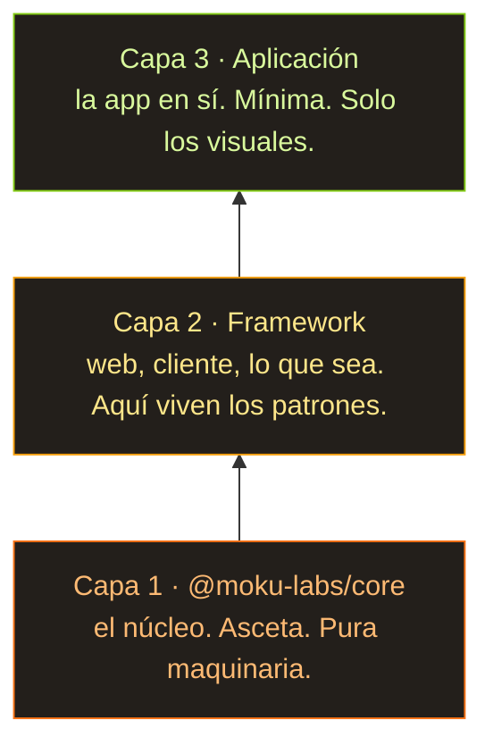

En cuanto los modelos se volvieron mínimamente más listos, a todo el mundo se le ocurrió la misma idea a la vez: ¿y si me genero yo solito el software que necesito y no le suelto ni un céntimo a esos programadores tuyos? Le dices al modelo: quiero un motor de blog. Que sea bonito, el más rápido, el mejor, sin un solo bug — o te vas a la cárcel. Y tres horas más tarde, por una suscripción de veinte pavos, tienes todo lo que pediste. Sin gastar una sola neurona. Lanzas el prompt y te vas a revisitar temporadas viejas de *House* — y las ves como si fueran nuevas, porque hace ya unos diez años que no sale nada interesante.

Y claro, en cuanto aterrizó esa idea, todo el mundo empezó a pegarle plugins ingeniosos, skills, llámalo como quieras, cualquier cosa con tal de que el prompt se porte bien, y que se porte el tiempo suficiente para entregar. Habrá etapas. Habrá una revisión de cada etapa del proyecto. GSD fue lo primero de este tipo que probé, y me quedé de piedra: creaba la apariencia de ingeniería seria. Luego llegaron otros mil esquemas igual de ingeniosos para fabricar actividad y la sensación de que el software que encargaste está *casi* aquí. Tienes un plan. Tienes una spec. Todo bajo control. El chisme es tan fácil de manejar que senté a mi mujer delante y no tuvo el menor problema; solo me llamaba para que respondiera las preguntas técnicas. Dime tú si no es un cuento de hadas.

## No del todo un cuento de hadas

La idea es genial mirándola por donde la mires: metes calderilla, sacas todo lo que siempre quisiste, todo de color de rosa.

...Bueno. No del todo. Y no tan de rosa. Lo que sacas en realidad va más bien así: probablemente hasta arranque, pero la cuenta de bugs será espectacular. Vas a depurar hasta quedarte sin sangre en la cara, arreglándolo a través de la IA, cómo no, y lo que acabas teniendo son cien funciones espagueti. Más o menos funciona, pero en cualquier momento dado algo en alguna parte está roto, de forma visible o invisible, y averiguar qué demonios está pasando ya no es humanamente posible.

Y nada de lo generado, me di cuenta, tiene un concepto que lo unifique. Ninguna idea de cómo encaja el conjunto. Todo toca todo, cada API se tira de cualquier sitio, el estado se vuelca donde caiga. Así no se hace software. Vale, sí, sí se hace, la gente lo hace. Pero si quieres algo que funcione *y* que luego se pueda mantener y ampliar, necesitas una idea de la arquitectura. Una simple, como un árbol. Porque a la IA no le gusta seguir instrucciones, así que tiene que ser obvia. Para el humano y para la máquina.

## Y así nació Moku Core

Un sistema de plugins que, juntos, ensamblan una aplicación. Cada pieza vive aislada en su propio plugin. Qué entra y cómo se configura lo decide el punto de entrada. Cómo funciona un plugin por dentro no es asunto de nadie, mientras funcione y respete su contrato.

```typescript
// A plugin is one self-contained contract: its config, its state, and the API it hands out.
export const routerPlugin = createPlugin("router", {

  // config — the defaults; every key becomes optional for whoever uses the plugin.
  config: { basePath: "/", notFoundRedirect: "/404" },

  // createState — private mutable state, owned by this plugin and nobody else.
  createState: () => ({ currentPath: "/", history: [] as string[] }),

  // events — declare what this plugin emits, with typed payloads.
  events: (register) => ({
    "router:navigate": register<{ from: string; to: string }>("Fired after navigation")
  }),

  // api — the public surface, mounted on `app.router`.
  api: (ctx) => ({

    // Become: app.router.navigate("/about");
    navigate: (path: string) => {
      ctx.state.history.push(ctx.state.currentPath); // remember where we were
      ctx.state.currentPath = path; // move to the new path
      // emit — announce it so any plugin listening to "router:navigate" can react
      ctx.emit("router:navigate", { from: ctx.state.history.at(-1)!, to: path });
    },

    // Become: app.router.current();
    current: () => ctx.state.currentPath // read the current path
  })
});

// Subscribing — another plugin depends on router and reacts to its events:
export const analyticsPlugin = createPlugin("analytics", {

  // defaults again — the entry point overrides this below
  config: { trackingId: "" },

  // unlocks the typed "router:*" events below
  depends: [routerPlugin],

  // runs on every "router:navigate" — the payload type comes from the declaration
  hooks: (ctx) => ({
    "router:navigate": ({ from, to }) =>
      console.log(`[${ctx.config.trackingId}] page view: ${from} -> ${to}`)
  })
});
```

Cada plugin declara su contrato: su estado, los eventos a los que se suscribe, la API que expone y los helpers que tira hacia fuera. O sea, que leyendo un solo archivo sabes exactamente lo mal que la IA fastidió el diseño de ese plugin. Y el punto de entrada simplemente los recoge:

```typescript
// The entry point decides what goes in and how it's configured:
const app = createApp({

  // order matters — analytics depends on router, so router comes first
  plugins: [routerPlugin, analyticsPlugin, blogPlugin],

  pluginConfigs: {
    router: { basePath: "/blog" }, // overrides the "/" default declared by the plugin
    analytics: { trackingId: "G-XXXXX" },
    blog: { postsPerPage: 5 }
  }
});

// In client code you just call the typed API — autocompleted, no imports, no globals:
app.router.navigate("/about"); // analytics logs: [G-XXXXX] page view: / -> /about
app.router.current(); // "/about"
app.blog.listPosts(); // 5 per page — straight from the config above
```

Los puedes extender, complicar. Hay forma de testearlos de manera determinista. Y todo el conjunto va empaquetado lo más minimalista que se puede, y encima te da las garantías más frescas que existen, como la type safety que TypeScript es capaz de demostrar de verdad. La gracia está en encoger el margen de error tanto como el lenguaje te deje.

## Un mes sobre una spec, no sobre código

Estuve sentado con esta idea cosa de un mes, no sobre código, sobre la spec. Sobre todo le pedía a la IA que modelara distintas situaciones contra mi API. Ya había intentado montar un sistema de plugins así muchas veces, en el trabajo y en mis propios motores de juego; la idea me vuelve a la cabeza una y otra vez. Botón de muestra: Beavy, mi proyecto soñado — un motor de juego en Rust. Me parece genuinamente brillante, y me inspiro en él (miento) a la menor ocasión.

La spec se llevó un mes. Tuve que trabajarme un montón de variantes: cómo correrlo en el navegador, cómo desde la consola, cómo en Node, cómo hacer las cosas isomorfas, cómo llevar el acoplamiento a cero. En mi vida había sudado tanto con documentación y la depuración infinita de esta movida. La IA escribe docs de maravilla. Programar, en cambio, no es su fuerte.

## Tres capas

También llegué a la idea de que la estructura tiene que tener tres capas de profundidad.



El núcleo se queda asceta. El framework que va encima existe para acaparar todos los patrones de un tipo concreto de software (web, una app cliente, lo que sea), pura y simplemente para ahorrarte la depuración-con-IA infinita cuando llegues a la app. Y la app que va encima de eso solo usa el framework. Así que abajo tienes un núcleo lamido hasta dejarlo limpio; un piso más arriba nos relajamos un poco y generamos un montón de código, ordenadito por plugin; y arriba del todo se sienta el código cliente que solo responde de la parte visual. La interfaz, a grandes rasgos.

## Por ahora todo es teoría

Y así fue como nació el proyecto.

Una cosa que conviene tener presente: todavía no hay segunda capa, ni tercera. Es todo pura teoría. Espero que aparezcan pronto, para poder por fin probar de verdad esa arquitectura de mis sueños que llevo tanto tiempo rumiando.
