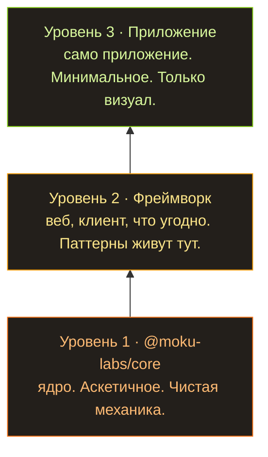

Как только модели стали хоть чуть-чуть умнее, все разом начали кумекать одну и ту же мысль: а что, если сгенерировать себе нужный софт и не заплатить при этом ни копейки этим вашим программистам? Говоришь модели: хочу движок для блога. Красивый, самый быстрый, самый лучший, без единого бага — иначе пойдёшь в тюрьму. И через три часа за двадцатибаксовую подписку у тебя есть всё, что ты хотел. Без какой-либо мозговой деятельности с твоей стороны. Просто отправил промт и пошёл пересматривать старые сезоны «Доктора Хауса», и смотришь их как новое, потому что ничего интересного не выходило уже лет десять.

И под эту идею все сразу начали лепить хитроумные плагины, скиллы, называй как хочешь, лишь бы заставить промт работать как надо и достаточно долго, чтобы он выдал заказанное. Там будут стадии. Там будет ревью каждой стадии проекта. GSD был первой такой штукой, которую я попробовал, и я был в шоке: оно создавало видимость, что это прям серьёзная разработка. Потом подъехала ещё тысяча примерно таких же хитроумных способов создать деятельность и ощущение, что ты вот-вот получишь софт, который заказал. Что у тебя есть план. Что есть спецификация. Что всё под контролем. Управление этой штукой такое простое, что я посадил за неё жену, и у неё не было никаких сложностей, она только звала меня ответить на технические вопросы. Ну скажи, не сказка?

## Не совсем сказка

Идея-то охуенная со всех сторон: за копейки получаешь всё, что хочешь, и всё в ажуре.

...Ну, не совсем так, конечно. И не в таком ажуре. Получаешь ты это примерно так: оно даже запустится — но количество багов будет феерическим. Дебажить будешь до посинения, фиксить, само собой, тоже через ИИ, и в итоге получишь сотню спагетти-функций. Оно как бы работает, но в каждый момент времени где-то баг — визуальный, невизуальный, — а понять, что там вообще происходит, уже нереально.

И вот что я заметил: у всего, что нагенерировано, нет никакой общей концепции. Никакой идеи, как это всё устроено. Всё связано со всем, все API дёргаются откуда попало, состояние свалено туда, куда удалось свалить. Так софт не пишут. Хотя ладно, пишут — чего уж там. Но если надо сделать что-то рабочее, что потом можно поддерживать и расширять, нужна идея архитектуры. Простая, как дерево. Потому что ИИ не очень любит следовать инструкциям, и архитектура должна быть очевидной. И человеку, и машине.

## Так и родилась Moku Core

Система плагинов, которые все вместе собирают приложение. Каждый кусок изолирован в своём плагине. Что собрать и как сконфигурировать — решает точка входа. А как плагин устроен внутри, всем плевать, пока он работает и выполняет контракт.

```typescript
// A plugin is one self-contained contract: its config, its state, and the API it hands out.
export const routerPlugin = createPlugin("router", {

  // config — the defaults; every key becomes optional for whoever uses the plugin.
  config: { basePath: "/", notFoundRedirect: "/404" },

  // createState — private mutable state, owned by this plugin and nobody else.
  createState: () => ({ currentPath: "/", history: [] as string[] }),

  // events — declare what this plugin emits, with typed payloads.
  events: (register) => ({
    "router:navigate": register<{ from: string; to: string }>("Fired after navigation")
  }),

  // api — the public surface, mounted on `app.router`.
  api: (ctx) => ({

    // Become: app.router.navigate("/about");
    navigate: (path: string) => {
      ctx.state.history.push(ctx.state.currentPath); // remember where we were
      ctx.state.currentPath = path; // move to the new path
      // emit — announce it so any plugin listening to "router:navigate" can react
      ctx.emit("router:navigate", { from: ctx.state.history.at(-1)!, to: path });
    },

    // Become: app.router.current();
    current: () => ctx.state.currentPath // read the current path
  })
});

// Subscribing — another plugin depends on router and reacts to its events:
export const analyticsPlugin = createPlugin("analytics", {

  // defaults again — the entry point overrides this below
  config: { trackingId: "" },

  // unlocks the typed "router:*" events below
  depends: [routerPlugin],

  // runs on every "router:navigate" — the payload type comes from the declaration
  hooks: (ctx) => ({
    "router:navigate": ({ from, to }) =>
      console.log(`[${ctx.config.trackingId}] page view: ${from} -> ${to}`)
  })
});
```

Каждый плагин описывает свой контракт: своё состояние, события, на которые он подписан, API, которое он предоставляет, и хелперы, которые он выкидывает наружу. А значит, осмотрев один файл, ты понимаешь ровно настолько, насколько ИИ облажался с дизайном этого плагина. А точка входа просто их собирает:

```typescript
// The entry point decides what goes in and how it's configured:
const app = createApp({

  // order matters — analytics depends on router, so router comes first
  plugins: [routerPlugin, analyticsPlugin, blogPlugin],

  pluginConfigs: {
    router: { basePath: "/blog" }, // overrides the "/" default declared by the plugin
    analytics: { trackingId: "G-XXXXX" },
    blog: { postsPerPage: 5 }
  }
});

// In client code you just call the typed API — autocompleted, no imports, no globals:
app.router.navigate("/about"); // analytics logs: [G-XXXXX] page view: / -> /about
app.router.current(); // "/about"
app.blog.listPosts(); // 5 per page — straight from the config above
```

Плагины можно расширять, усложнять. Есть идея, как их детерминированно тестировать. И всё это упаковано максимально минималистично, плюс даёт свежайшие гарантии вроде type safety, которые TypeScript способен доказать. Смысл в том, чтобы ужать пространство для ошибки по максимуму.

## Месяц над спекой, а не над кодом

С этой идеей я просидел, наверное, месяц — не над кодом, над спекой. В основном я просил ИИ моделировать разные ситуации против моего API. Я уже много раз пытался собрать такую систему плагинов — и на работе, и в своих игровых движках; эта идея у меня всплывает постоянно. Как пример: Beavy, мой проект мечты — игровой движок на Rust. Я считаю, он просто охуенный, и вдохновляюсь (пизжу) им при любой возможности.

Спека заняла месяц. Нужно было проработать кучу вариантов: как запускать это в браузере, как из консоли, как на ноде, как делать вещи изоморфно, как свести связанность к нулю. Я в жизни столько не потел над документацией и бесконечным дебагом этой херни. Доку ИИ пишет классно. А вот кодинг — не сильная сторона ИИ.

## Три уровня

Ещё я пришёл к мысли, что структура должна быть трёхуровневой.



Ядро остаётся аскетичным. Фреймворк поверх него существует, чтобы стащить в себя все паттерны конкретного типа софта: веба, клиентского приложения, чего угодно. Чисто чтобы избежать бесконечного ИИ-дебага, когда дойдёшь до приложения. А приложение наверху просто использует фреймворк. Так что внизу у нас вылизанное ядро; этажом выше мы чуть расслабляемся и генерируем дофига кода, разложенного по плагинам; а наверху сидит клиентский код, который отвечает чисто за визуальную часть. За интерфейс, грубо говоря.

## Пока всё это теория

Так и родился этот проект.

Нужно понимать: пока нет ни второго уровня, ни третьего. Это всё чистая теория. Надеюсь, они скоро появятся, и я наконец проверю на деле ту архитектуру мечты, над которой давно сижу.
