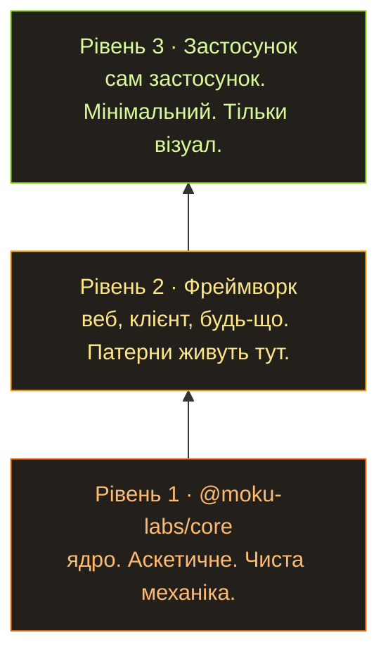

Щойно моделі стали хоч трохи розумнішими, всі разом почали кумекати одну й ту саму думку: а що, як згенерувати собі потрібний софт і не заплатити при цьому ні копійки оцим вашим програмістам? Кажеш моделі: хочу движок для блогу. Красивий, найшвидший, найкращий, без жодного бага — інакше підеш у тюрму. І за три години на двадцятибаксовій підписці в тебе є все, що ти хотів. Без жодної мозкової діяльності з твого боку. Просто відправив промт і пішов передивлятися старі сезони «Доктора Хауса», і дивишся їх як новеньке, бо нічого цікавого не виходило вже років десять.

І під цю ідею всі одразу взялися ліпити хитромудрі плагіни, скіли, називай як хочеш, аби лиш змусити промт працювати як слід і достатньо довго, щоб він видав замовлене. Там будуть стадії. Там буде ревʼю кожної стадії проєкту. GSD був першою такою штукою, яку я спробував, і я був у шоці: воно створювало видимість, що це прям серйозна розробка. Потім підʼїхала ще тисяча приблизно таких самих хитромудрих способів створити діяльність і відчуття, що ти ось-ось отримаєш софт, який замовив. Що в тебе є план. Що є специфікація. Що все під контролем. Керування цією штукою таке просте, що я посадив за неї дружину, і в неї не виникло жодних труднощів, вона тільки кликала мене відповісти на технічні питання. Ну скажи, не казка?

## Не зовсім казка

Ідея ж охуєнна з усіх боків: за копійки отримуєш усе, що хочеш, і все в ажурі.

...Ну, не зовсім так, звісно. І не в такому ажурі. Отримуєш ти це приблизно так: воно навіть запуститься — але кількість багів буде феєричною. Дебажити будеш до посиніння, фіксити, само собою, теж через ШІ, і врешті отримаєш сотню спагеті-функцій. Воно ніби працює, але в кожну мить десь баг — візуальний, невізуальний, — а зрозуміти, що там узагалі відбувається, уже нереально.

І ось що я помітив: у всього, що нагенеровано, немає жодної спільної концепції. Жодної ідеї, як це все влаштовано. Усе повʼязане з усім, усі API смикаються звідки попало, стан звалено туди, куди вдалося звалити. Так софт не пишуть. Хоча гаразд, пишуть — чого вже там. Але якщо треба зробити щось робоче, що потім можна підтримувати й розширювати, потрібна ідея архітектури. Проста, як дерево. Бо ШІ не дуже любить дотримуватися інструкцій, і архітектура має бути очевидною. І людині, і машині.

## Так і народилася Moku Core

Система плагінів, які все разом збирають у застосунок. Кожен шматок ізольований у своєму плагіні. Що зібрати і як сконфігурувати — вирішує точка входу. А як плагін влаштований зсередини, усім байдуже, поки він працює й виконує контракт.

```typescript
// A plugin is one self-contained contract: its config, its state, and the API it hands out.
export const routerPlugin = createPlugin("router", {

  // config — the defaults; every key becomes optional for whoever uses the plugin.
  config: { basePath: "/", notFoundRedirect: "/404" },

  // createState — private mutable state, owned by this plugin and nobody else.
  createState: () => ({ currentPath: "/", history: [] as string[] }),

  // events — declare what this plugin emits, with typed payloads.
  events: (register) => ({
    "router:navigate": register<{ from: string; to: string }>("Fired after navigation")
  }),

  // api — the public surface, mounted on `app.router`.
  api: (ctx) => ({

    // Become: app.router.navigate("/about");
    navigate: (path: string) => {
      ctx.state.history.push(ctx.state.currentPath); // remember where we were
      ctx.state.currentPath = path; // move to the new path
      // emit — announce it so any plugin listening to "router:navigate" can react
      ctx.emit("router:navigate", { from: ctx.state.history.at(-1)!, to: path });
    },

    // Become: app.router.current();
    current: () => ctx.state.currentPath // read the current path
  })
});

// Subscribing — another plugin depends on router and reacts to its events:
export const analyticsPlugin = createPlugin("analytics", {

  // defaults again — the entry point overrides this below
  config: { trackingId: "" },

  // unlocks the typed "router:*" events below
  depends: [routerPlugin],

  // runs on every "router:navigate" — the payload type comes from the declaration
  hooks: (ctx) => ({
    "router:navigate": ({ from, to }) =>
      console.log(`[${ctx.config.trackingId}] page view: ${from} -> ${to}`)
  })
});
```

Кожен плагін описує свій контракт: свій стан, події, на які він підписаний, API, яке він надає, і хелпери, які він викидає назовні. А отже, оглянувши один файл, ти розумієш рівно настільки, наскільки ШІ облажався з дизайном цього плагіна. А точка входу просто їх збирає:

```typescript
// The entry point decides what goes in and how it's configured:
const app = createApp({

  // order matters — analytics depends on router, so router comes first
  plugins: [routerPlugin, analyticsPlugin, blogPlugin],

  pluginConfigs: {
    router: { basePath: "/blog" }, // overrides the "/" default declared by the plugin
    analytics: { trackingId: "G-XXXXX" },
    blog: { postsPerPage: 5 }
  }
});

// In client code you just call the typed API — autocompleted, no imports, no globals:
app.router.navigate("/about"); // analytics logs: [G-XXXXX] page view: / -> /about
app.router.current(); // "/about"
app.blog.listPosts(); // 5 per page — straight from the config above
```

Плагіни можна розширювати, ускладнювати. Є ідея, як їх детерміновано тестувати. І все це запаковано максимально мінімалістично, плюс дає найсвіжіші гарантії на кшталт type safety, які TypeScript здатен довести. Сенс у тому, щоб стиснути простір для помилки по максимуму.

## Місяць над специфікацією, а не над кодом

З цією ідеєю я просидів, мабуть, місяць — не над кодом, над специфікацією. Здебільшого я просив ШІ моделювати різні ситуації проти мого API. Я вже багато разів намагався зібрати таку систему плагінів — і на роботі, і у своїх ігрових рушіях; ця ідея в мене зринає постійно. Як приклад: Beavy, мій проєкт мрії — ігровий рушій на Rust. Я вважаю, він просто охуєнний, і надихаюсь ним (пиздю) за будь-якої нагоди.

Специфікація зайняла місяць. Треба було проробити купу варіантів: як запускати це в браузері, як із консолі, як на Node, як робити речі ізоморфно, як звести звʼязаність до нуля. Я в житті стільки не пітнів над документацією й безкінечним дебагом цієї херні. Доку ШІ пише класно. А ось кодинг — не сильна сторона ШІ.

## Три рівні

Ще я дійшов думки, що структура має бути трирівневою.



Ядро лишається аскетичним. Фреймворк над ним існує, щоб стягнути в себе всі патерни конкретного типу софту: вебу, клієнтського застосунку, чого завгодно. Суто щоб уникнути безкінечного ШІ-дебагу, коли дійдеш до застосунку. А застосунок поверх фреймворку просто його використовує. Тож унизу в нас вилизане ядро; поверхом вище ми трохи розслабляємося й генеруємо дофіга коду, розкладеного по плагінах; а нагорі сидить клієнтський код, який відповідає суто за візуальну частину. За інтерфейс, грубо кажучи.

## Поки що все це теорія

Так і народився цей проєкт.

Треба розуміти: поки немає ні другого рівня, ні третього. Це все чиста теорія. Сподіваюся, вони скоро зʼявляться, і я нарешті перевірю на ділі ту архітектуру мрії, над якою давно сиджу.
