Por fin llegó, la compra tan esperada y polémica. La quería muchísimo, pero el precio y las reseñas sobre su balance me hacían posponerla. Un poco de espontaneidad y aquí está.

> In the darkest depths of Terrinoth, an ambitious overlord gathers his minions to lay siege on the world above. Only a small band of heroes, gifted with courage and power, will be able to save the land from the cold grip of domination. Now is the time to venture into the dark and unravel the overlord's plot before it's too late…

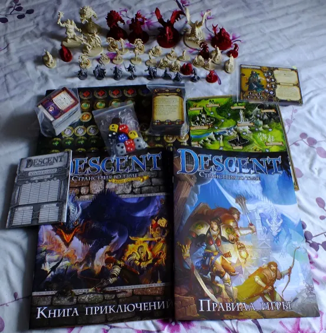

## De qué trata el juego

El juego trata sobre la épica aventura de unos héroes en las mazmorras de un Oscuro Señor del Mal que no perderá la ocasión de mostrarles a los héroes quién manda aquí. Es un juego para 2–5 jugadores: ¿de dónde voy a sacar yo tantos amigos? Uno de los jugadores se pone en la piel del mal universal y se convierte en el Señor Oscuro. El resto se convierten en héroes corrientes, divididos por clases y arquetipos. Los héroes recorren mazmorras, buscan tesoros, luchan contra los esbirros del Señor Oscuro, compran equipo… en pocas palabras, lo dan todo.

Todo el combate consiste en tirar dados: hay ataques cuerpo a cuerpo y a distancia. Y, por supuesto, hechizos, muchos hechizos, ¿cómo va a faltar?, al fin y al cabo es fantasía.

El juego consta tanto de misiones independientes como de una campaña. Una campaña es un conjunto de misiones sueltas unidas por una trama común. Los héroes pueden llevarse su botín, conseguido con el duro esfuerzo del saqueo, a la siguiente misión, acumulando así toda una fortuna para el final de la campaña. Una campaña no la terminarás en un solo día: lleva decenas de horas y, precisamente para eso, el juego ofrece un sistema de guardado: una libreta y un lápiz.

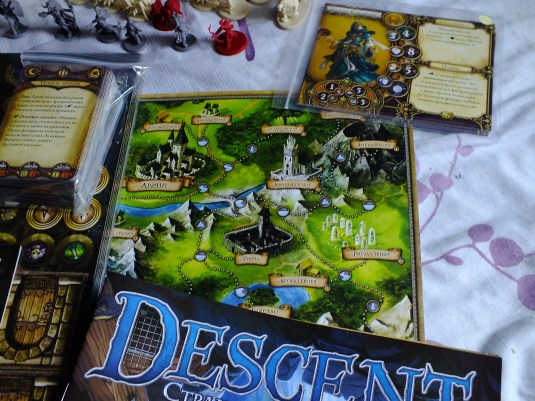

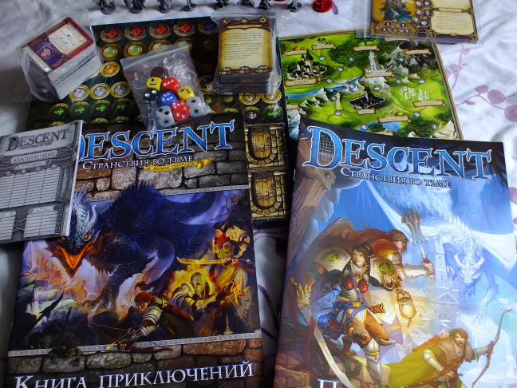

## Impresiones

Todavía no lo he probado, y ni siquiera he terminado de leer las reglas (un librito de 20 páginas). Pero seguro que os cuento en cuanto tenga la ocasión de probarlo.

Las figuras impresionan, están bastante detalladas e infunden verdadero terror. Me gustó la solución de las losetas: con ellas se monta el mapa de la mazmorra y, como hay tantísimas, eso le da al juego una gran rejugabilidad y variedad.

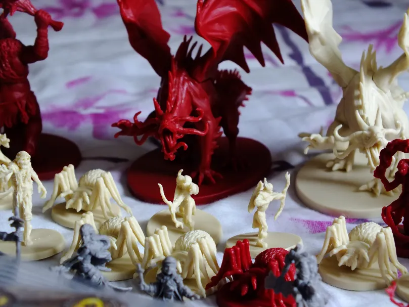

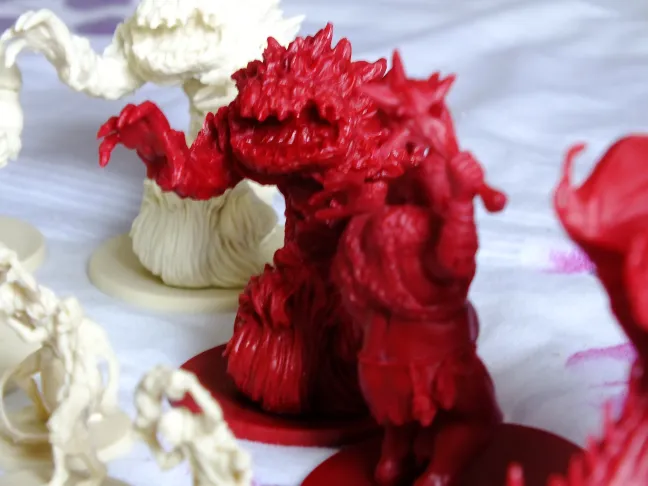

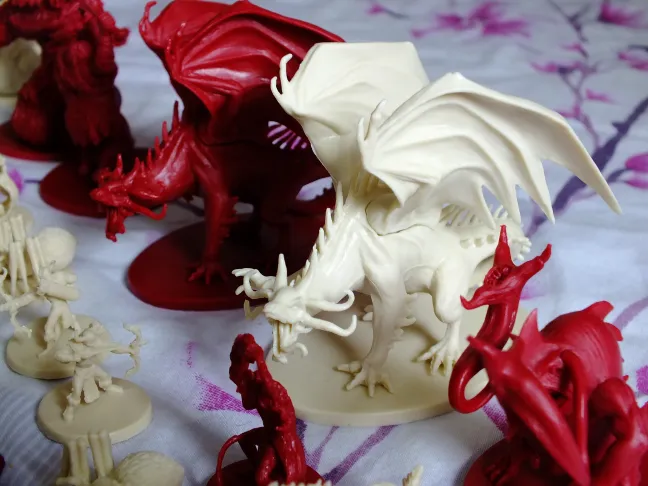

En cuanto a lo negativo, está el balance; a juzgar por lo que leí en las reglas, jugar como Señor Oscuro resulta algo aburrido, y los héroes casi siempre llevan la ventaja, son prácticamente inmortales.

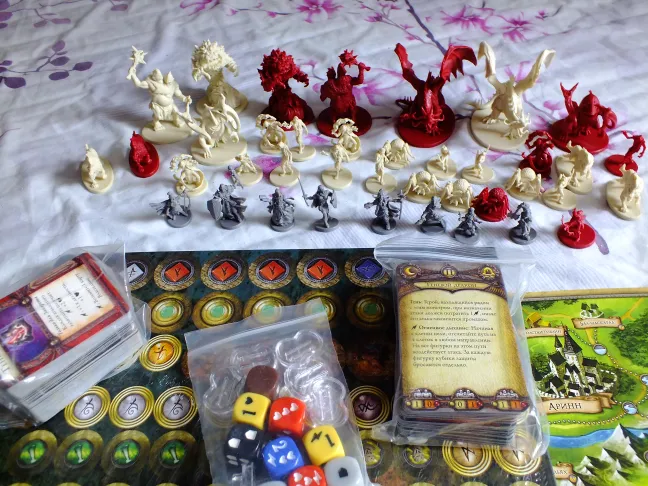

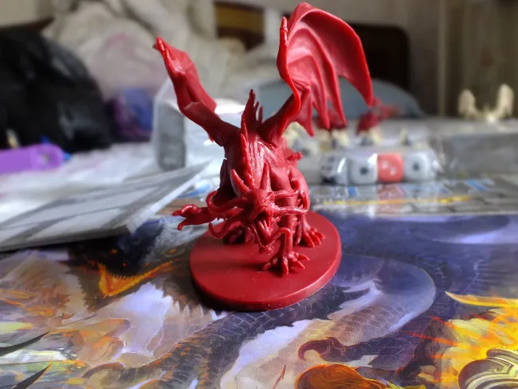

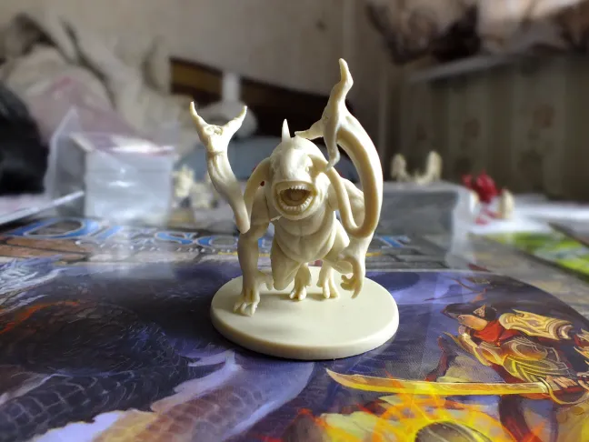

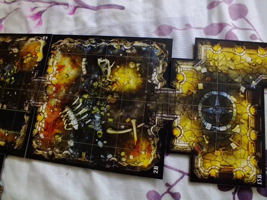

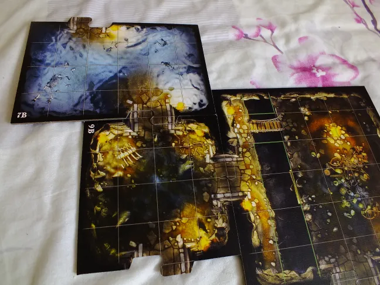

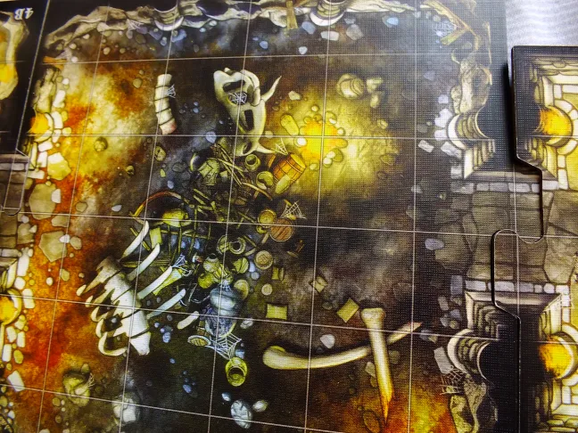

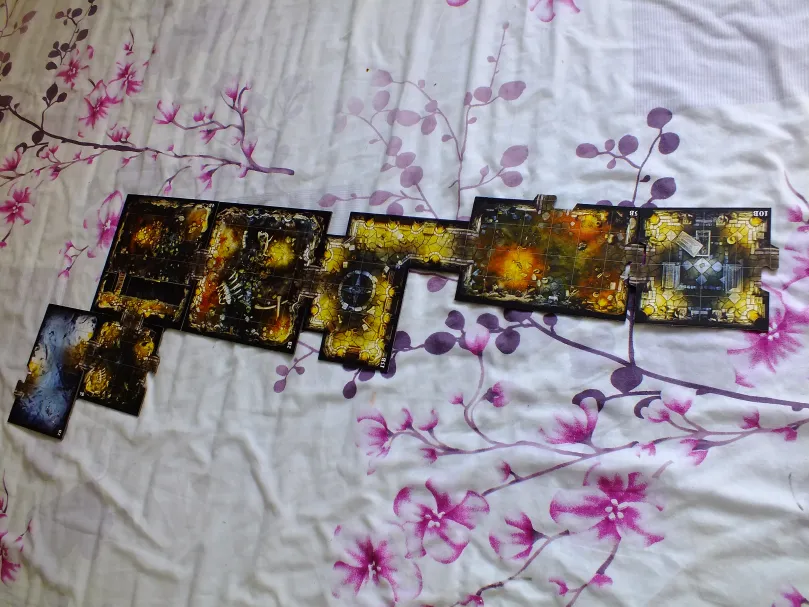
