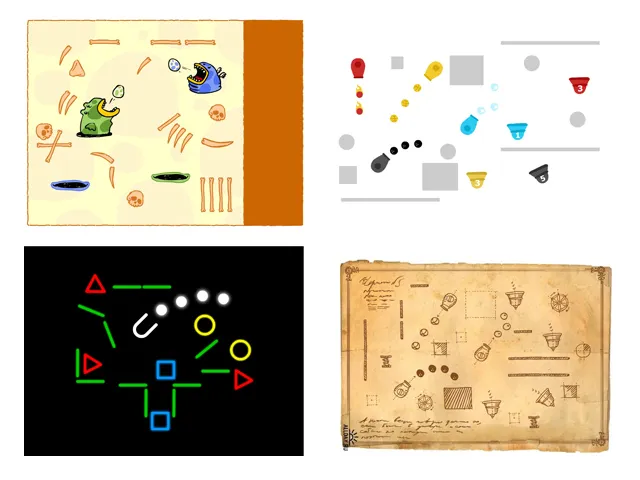
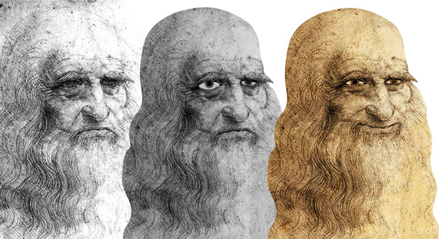
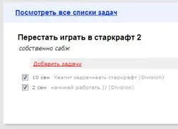
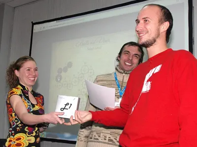
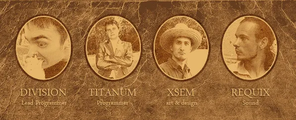

[Ось](https://geeklife.in.ua/2010/07/27/make-game-in-nine-days/) із чого все почалося, а [ось](http://armorgames.com/play/10964/fun-da-vinci) до чого ми прийшли. Ми багато чого змінили, зібрали згуртовану команду й отримали досвід продажу гри — усім цим ми поділимося з тобою, любий читачу. Цікаво? Ласкаво просимо під кат.

## Програмування

Тут усе просто — я і Микита Сидоренко (Division). Кажуть, що два програмісти на одній нескладній флеш-грі — це забагато, але я цю позицію категорично не поділяю. Як показала практика, якщо писати гру наодинці, то невдовзі забиваєш. Може, річ, звісно, і в нас, але повірте, ми пробували — удвох і веселіше, і прогрес іде. Я пояснюю це з точки зору сумління: якщо один щось робить, то другому соромно, що він байдикує, і він починає підключатися до процесу.

## Дизайн

Із нього все починається, і в якісній грі він стоїть на чільному місці. Як відомо, дизайн для попередньої частини малював (тирив) я. Це проходить на конкурсі, але для успішного продукту потрібен уже нормальний, а головне ексклюзивний арт. Херсон — місто маленьке, усі всіх знають в обличчя, хороших дизайнерів раз-два і нема, тож [«фрилансера з глибинки» Семена Храмцова](https://www.youtube.com/watch?v=K7r9dbqYrHs) довго шукати не довелося.

_«Хоч я й не любив головоломки, але ентузіазм хлопців мене заразив. Спершу я запропонував
кілька варіантів арту, серед яких була й стилізація під рукописи Леонардо.
На неї всі око й поклали. Звісно, у графічному дизайні цей прийом дуже попсовий,
але вабила жага синтезу інтерактивного середовища з небезвідомим стилем замальовок мегадизайнера
епохи Відродження. Я перечитав його біографію, перегуглив його роботи, щоб виудити
якомога більше родзинок для гри — словом, максимально зануритися в потрібну атмосферу. Звісно,
те, що вийшло, вважаю знущанням над його образом і винаходами, але куди
нам до Майстра? Слава богу, що я не перефарбував гру в яскраві, «казуальні» кольори,
як нам порадив на гейм-лінчі один із суддів, — тоді точно горіли б у пеклі.
Найбільше досягнення для мене в цій роботі — це занурення в левел-дизайн і
комбінація похмурого автопортрета художника з усмішкою Джоконди :)» — Семен Храмцов._

## Звук і музика

Залишилася остання, але аж ніяк не менш важлива ділянка — це музичне та звукове оформлення гри. Воно не лише оживляє гру, а й не дає користувачеві занудьгувати, принаймні поки не почне його дратувати. У Семена якраз виявився знайомий, дуже талановитий композитор, з яким він уже давно працював над невеликими флешевими проєктами, — [Володимир Маринічев](http://requix.promodj.ru/), що було дуже до речі.

_«Найперше, щоб зануритися в атмосферу епохи Відродження, я переглянув фільм-біографію Леонардо да Вінчі та прослухав роботи композиторів того часу. За основу теми меню я взяв твір Клода Жерве, який передавав би настрій вдумливого Творця і переносив гравця в епоху Ренесансу. Аранжування, а також інструментальний набір постарався виконати в притаманному тому часу стилі.
Для саунд-дизайну ігрового процесу багато звуків було записано з використанням підручних предметів. Рівні вирішили залишити без музичного супроводу, а натомість передати атмосферу майстерні. Під час гри чути, як Леонардо постійно робить нотатки і щось наспівує собі під ніс, захоплено виконуючи черговий свій дослід.
На жаль, прагнучи зменшити розмір гри, довелося врізати якість усіх звуків і музики, що, звісно, завадило реалістично передати всі тонкощі й деталі. Але загалом результатом багато хто залишився задоволений, і, звісно, було дуже приємно отримати високу оцінку від FGL» — Володимир Маринічев_

Отже, команда зібрана — у путь…

## Початок

Перший коміт відбувся 4 серпня 2010 — його можна вважати початком розробки. Ми повільно почали фіксити баги, і оскільки в нас усіх є основна робота, усе це відбувалося дуже повільно. Ми підключили собі таск-менеджер, створили там купу тасків, багато обговорень — усе, звісно, ні про що. У кінцевому вигляді, якщо брати до уваги всі таски, гра мала б виглядати як міні Starcraft 2 зі своїм BattleNet`ом (він якраз тоді й вийшов, що дуже відволікало). Саме в нереальності наших планів і крилася перша помилка. Не будуйте величезних замків. На більшу частину ви заб'єте, коли до вас дійде, що ваші плани здивували б навіть Наполеона. З нами так і сталося. Ми все це усвідомили, коли вирішили взяти участь у FlashGamm KYIV 2010. Треба було щось показати, а в нас нічого не було, навіть робочого прототипу. Ось тоді й почалася справжня робота. Найперше посносили більшу частину тасків, усе, що можна, мінімізували й оптимізували. І це дало результати.

## FlashGamm KYIV 2010

До початку конференції ми змогли зібрати щось схоже на прототип і зробити кілька нудних рівнів. Із цим Семен і Микита вирушили до Києва. Брали участь ми в категорії «Інді», плюс ми ще записалися на гейм-лінч — ох і натикали нам там… Але сам по собі гейм-лінч був дуже корисний: нам указали на недоробки нашої гри, на наші промахи й порадили, куди рухатися далі. Тішило, що багато з названих недоліків ми спрогнозували вже заздалегідь. На голосуванні аудиторії за найкращу гру гейм-лінча наша гра набрала рівно 0 очок (дзен) — і ніхто з нас після цього не сподівався, що ми можемо взяти бодай щось. Але несподівано ми взяли номінацію «Майбутній хіт»! Радості не було меж. Я думаю, ця подія позитивно вплинула на дух команди — ми усвідомили, що в грі щось є, і потрібно її завершити, чого б це не коштувало.

## Підходимо до кінця

Після конкурсу розробка вже йшла в налагодженому режимі, усе працювало як годинник. Але були прикрі баги. Перший баг — це провалювання предметів, він переслідував нас іще в Ball Factory (у першому прототипі). Вирішили банально, методом наукового тику. Я почав гратися з налаштуваннями Box2D і знайшов одну особливість: якщо змінити `b2_aabbMultiplier` з 0,2 на 0,1, то провалювання магічним чином фіксилося. А ось другий баг підкрався звідти, звідки ми не чекали. Ми скрізь, де треба було робити кнопку, юзали `SimpleButton`, і навіть гадки не мали, що в новіших версіях плеєра стани кнопки починали залипати, і це ніяк не поправити, до яких би хитрощів ми не вдавалися — нічого не допомагало, довелося робити свій самокат. Обговорення на [flasher.ru](http://www.flasher.ru/forum/showthread.php?t=148860).

## Продаж

На FlashGamm сталася ще одна подія — ми познайомилися зі Стефаном Кейшем. Ми взагалі не знали, як продати гру. В інтернеті, звісно, було щось про FGL (Flash Game License), але все було розпливчасто, до того ж треба було залучати спонсорів. Стефан цим, власне, і займається, не безкоштовно, звісно, — 30% від проданої гри. Подумавши й порадившись, ми вирішили прийняти цю пропозицію. Стефан ще дає рекомендації, як зробити гру привабливішою для спонсора. Перше, на що він указав, — це назва. Річ у тім, що робоча назва гри була «Balls Da Vinci» — саме з цією назвою ми брали участь у FlashGamm. Та, на жаль, ця назва викликала багато зайвих асоціацій із чоловічою гідністю Леонардо (що не могло не тішити), тож ми перейменувалися на «Fun Da Vinci» (може, це тільки для нас головоломка, а для мозку да Вінчі — жарти).

Лот був виставлений на FGL 14 січня 2011. Кожному, хто виставляє гру, FGL робить рев'ю.

_Review Information:_

Intuitiveness: 7 Good
Fun: 6 Average
Graphics: 7 Good
Sound: 8 Great
Quality: 7 Good
Overall: 7 Good

Comments:
Standard execution of a traditional physics game with a Leonardo da Vinci theme
Creative level design, familiar game mechanics, polished interface
Lacks depth beyond first playthrough. Consider adding achievements or a scoring mechanism of some sort

Одразу ж нам запропонували $1000, але ми хотіли більшого, щонайменше $3к. Ця ставка трималася близько місяця, ми вже зневірилися, але раптом за гру почали битися кілька великих порталів (я думаю, без Стефана тут не обійшлося). Ставки то росли, то затихали. Було помічено, що до кінця тижня активність спонсорів зростала. Коли ставка дійшла до $3000, ми ледь не зірвалися її прийняти, але хтось лисий запропонував зачекати — адже в цей момент до нас надійшла пропозиція від порталу [jayisgames.com](http://jayisgames.com/) написати [огляд](http://jayisgames.com/archives/2011/03/fun_da_vinci.php) до гри. Ми зраділи, адже окрім «респекту» від відомого порталу могла виникнути нова хвиля ставок, — і це сталося… Після чергових спонсорських боїв за гру ставка зупинилася на $5600. Ми придушили свою «жабу» і прийняли ставку. Це була ще одна перемога. Від публікації гри на FGL до прийняття ставки минуло рівно 2 місяці.

Як ви вже, мабуть, здогадалися, переміг Armor Games. Зазвичай спонсори просять зробити брендинг під свій портал, поставити intro, підключити API і т.д. Усе це легко робиться, але в нас виникли проблеми з Armor Games' API — воно нізащо не хотіло підключатися. Ми зробили порожній проєкт — у ньому все чудово працює, а в проєкті гри — ні. Не знаю, яким дивом, але Микита з'ясував, що якщо API ініціалізувати в прелоадері, то все ок, — дивно, звісно, ну та гаразд.

## Ділимо гроші

Отже, вам усім цікаво, скільки ми заробили? Ну що ж, розклад такий:
FGL бере за свої послуги 10% (половину, за домовленістю, платить Стефан);
10% від 5600 = 560 (доля FGL);
560 / 2 = 280 (частина долі FGL, яку оплачуємо ми);
30% від 5600 = 1680 (доля Стефана);
Підсумок: 5600 – 280 – 1680 = 3640.

Три з половиною штуки на 4 людей за 4 місяці — непоганий результат, як для гастарбайтерів із Нігерії. Як жити на самих лише іграх? — питання, яке нас спантеличило, але, попри це, ентузіазму тільки додалося, і наше хобі кидати не будемо. А відповідь на це питання обов'язково вирішимо або знайдемо, може, навіть у коментарях до цього поста ;)

## Плани на майбутнє

Ми вже робимо другу версію з новими предметами, рівнями та фічами. Є ідеї цікавих геймплеїв і незайманих тематик. По технічній частині дивимося в бік App Store та Android Market — Unity3D нам на допомогу.

