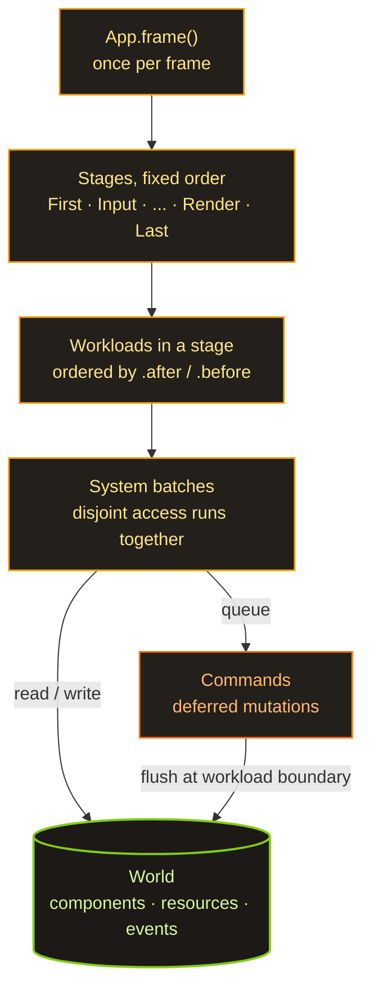

My last Spark post ended on a question: where would I fold this time. Well — I haven't folded yet. Stage one of the ECS is behind me: there's a stable API and a naive-but-working implementation. The engine still draws nothing on screen, but the heart is already beating.

Quick recap for anyone who skipped [part one](/spark/): Spark is my game engine in Rust where everything is built around a single ECS. I steal the system syntax from Bevy, workloads from Shipyard, and the storage I built my own way.

## A sparse set, not archetypes

The most important architectural decision is the storage, and there are two big camps here. Bevy (and hecs, and flax) use archetypes: entities with the same set of components sit together in dense tables. Shipyard uses a sparse set: every component type gets its own separate storage.

I went with a sparse set, like Shipyard, rather than archetypes, like Bevy. The reason is embarrassingly simple: it's easier. Archetypes are faster on pure traversal, but writing them from scratch is its own genre of pain — entities migrating between tables, fragmentation, all of it. And I cared more about understanding every line than about squeezing out the last microsecond. Besides, the API is designed so I can move to archetypes later without breaking anything on the outside. But more on that at the very end.

## How it sits in memory

The storage for one component `T` is three parallel arrays:

```text
sparse:        [ Some(0), None, Some(1), None, Some(2) ]
                   E0            E2             E4
dense:         [ Pos0,          Pos2,          Pos4 ]     <- packed back to back
entity_index:  [ E0,            E2,            E4   ]
```

`sparse` is indexed by the entity's number and tells you where its data lives in `dense` (or that there's none at all). `dense` is the components themselves, packed back to back, no holes. `entity_index` answers the reverse question: whose row is this in `dense`. Insert, remove, lookup — all O(1). Removal is a swap-remove: plug the hole in `dense` with the last element and fix a single pointer in `sparse`. The array stays dense.

And here's the answer to "why is it even fast." When a system walks every `Position`, it reads `dense` straight through, byte after byte. The CPU adores this: the prefetcher guesses what's coming next, and the cache lines are stuffed with useful data instead of pointers. Compare that with classic OOP, where you have an array of pointers to objects scattered across the heap — there, every step of the loop is a trip to memory and a cache miss. Data-oriented design basically says: lay your data out the way the processor will read it, not the way that's comfortable for a human. The ECS takes that idea to its logical extreme.

## Workloads: a real example

A system in Spark is a plain function, and its parameters declare what it reads and writes. A workload is a named batch of systems that belong together:

```rust
// A workload is a named batch of systems. Each system's parameter types
// declare what it reads and writes; the scheduler uses those access sets to
// decide what may share a parallel batch and what must run in order.
app.add_workload(Workload::PowerGrid, Stage::FixedUpdate, |w| {
    // Both write the grid, so they can't share a batch — and an *undeclared*
    // order between two writers is a registration error, not a guess.
    let supply = w.add_system(collect_supply);
    let demand = w.add_system(compute_demand).after(supply);

    // Reads the finished grid, so it runs last.
    w.add_system(distribute_power).after(demand);
})
.after(Workload::Simulation); // whole workloads order by label, same .after / .before
```

The scheduler reads the access sets (the parameter types declare them) and works out for itself what conflicts with what. If two systems both write the same `PowerNetwork` and no order between them is declared, that's a registration error — not "eh, it'll sort itself out." But systems that touch disjoint data, it's free to pack into one batch and run in parallel.

Free to — but not doing it yet. The parallel executor is M4, still ahead of me, and today everything runs sequentially. The access model is already in place, though, and that's deliberate: when I get to Rayon, it'll be swapping a `RefCell` for an `UnsafeCell` behind an already-proven-correct scheduler, not a rewrite.

## How the files are laid out

```text
lib/ecs/
├─ src/
│  ├─ entity.rs       # Entity = (index, generation) + allocator with a free list
│  ├─ storage.rs      # ComponentStorage<T> — sparse set + the change counter
│  ├─ world.rs        # World: HashMap<TypeId, Box<dyn AnyStorage>>
│  ├─ query/          # Query<D, F>: data, filters, joins, driver selection
│  ├─ system/         # SystemParam + IntoSystem — a function becomes a system
│  ├─ workload.rs     # workloads: labels, builder, topo-sort
│  ├─ scheduler.rs    # runs stages → workloads → systems
│  ├─ commands.rs     # deferred spawn / despawn / insert / remove
│  ├─ events.rs       # Events<T> + Reader / Writer (double-buffered)
│  └─ access.rs       # access sets + conflict detection
└─ macros/            # #[derive(Component / Resource / Event / WorkloadLabel)]
```

## How a frame runs



Once per frame, `App` pokes the scheduler. It walks the stages strictly in order; inside each stage, the workloads run in their `.after` / `.before` order; inside each workload, the systems run in batches by access. Commands (`spawn`, `despawn`, `insert`) aren't applied right away — they pile up and flush at the workload boundary. Events live in a double buffer and swap once at the top of the frame, so a reader always sees exactly the previous frame, and the order of systems within a frame stops mattering. Boring and predictable, which is what a simulation wants.

## Change detection: on the second attempt

The piece I'm happiest with is change detection. The `Changed<T>` and `Added<T>` filters let a system process only the entities whose component changed (or first appeared) since its last run. For a simulation where three of ten thousand entities actually move in a given tick, that's the difference between "recompute everything" and "recompute three."

```rust
// `Query<&mut T>` hands back a `Mut<T>`, not a bare `&mut T`. Taking the
// mutable borrow *is* the change signal: write through it and this entity's
// `changed_tick` moves; read through it and nothing is marked.
fn fluctuate(mut q: Query<&mut BusVoltage>) {
    for mut v in q.iter_mut() {
        v.0 = v.0.wrapping_add(1); // DerefMut here -> this bus is "changed"
    }
}

// Re-solve only the substations whose voltage actually moved this tick.
// `Changed<BusVoltage>` filters to those; the three-component shape already
// drops bare buses before the filter even matters.
fn grid_solver(q: Query<(&BusVoltage, &Transformer, &Feeder), Changed<BusVoltage>>) {
    for (_v, _t, _f) in &q {
        // ... re-solve this substation
    }
}
```

The precision rides on a small trick. `Query<&mut T>` hands you a `Mut<T>` wrapper, not a bare `&mut T`, and the "changed" signal is the very act of taking the mutable borrow through `DerefMut`. Walk a thousand entities, write to three, and exactly three marks move. Read through `Deref` only, and nothing moves.

The decision I'm proudest of cost me two implementations. The change counter can be done two ways: one global counter for the whole `World`, or a counter per component type. The original plan had the global one. The AI and I wrote both and compared them head to head. The per-component counters won — they solve three problems the global model could only paper over with warnings:

- components attached before any system runs are visible on a system's very first pass (counters start at 1, the reader's baseline at 0);
- a tuple-join driver doesn't mark the extra entities that never made it into the join;
- entities spawned through `Commands` reach an `Added` reaction the next frame.

The global version didn't get thrown out — it sits on a branch as a monument. And somewhere along the way it turned out the `u32` counter will eventually overflow, and the naive "tick greater than baseline" check quietly breaks at the wrap. The cure is comparing relative age with the wrap in mind (`current - tick < current - baseline`). A genre classic: the feature works, and then you spend half a day thinking about what happens four billion ticks from now.

## And how badly we lose

With stage one wrapped up, I put together a benchmark harness: spark-ecs against five live ECS on one machine. Here's the gist (10k entities, single-threaded, Apple M4 Pro; lower is better):

| metric | spark | hecs | bevy | shipyard | flax |
|---|---|---|---|---|---|
| iter, µs (read) | 18.5 | 6.5 | 6.3 | **5.0** | 6.1 |
| iter_mut, µs (write) | 56.4 | 19.5 | 10.2 | 11.0 | **10.0** |
| memory, B / entity | 126 | **66** | 145 | 96 | 93 |
| dependencies, crates | 6 | **4** | 59 | 17 | 21 |

In short: on reads we're about 3–4× slower than the leaders, on writes about five. Sounds like a death sentence. But before I start the sackcloth and ashes, three caveats:

1. **This is single-threaded.** Spark has no parallel scheduler yet (that's M4), and Bevy's defining superpower — its parallel scheduler — is switched off here too. So it's an honest snapshot of "where I am right now," but it is not the real gap to Bevy. That one opens up under multithreading, which nobody runs here.
2. **This is a pure-traversal test — archetypes' best friend and a sparse set's worst enemy.** The scenario a sparse set is built for in the first place (cheap insert / remove with no migrations between tables) isn't measured here at all. So my architecture hasn't even played its own home game yet.
3. **Writes are slower for a reason** — every `&mut` goes through that `changed_tick` stamp. That's the price of change detection, which half the rivals don't even do by default.

The bright spot is the dependencies. Spark drags in 6 crates. Bevy, 59. I'm second only to hecs, and that's with everything written on the bare standard library. On memory, a solid mid-table finish. So for a naive, from-scratch sparse set, three-to-four times slower on someone else's turf is, honestly, not that bad.

## What's next

The benchmark itself is the plan. It pins down the "today" point so future work can be measured as a delta on the same machine, not on vibes.

Next up is a detailed performance inventory: run not just `iter` and `spawn` but every slice of the API, and dump it all into a report with numbers. After that, an AI optimization pass — this time with those numbers in hand.

The one lever I'm sure of is M4: Rayon and the parallel executor. But Stage 24, the move to archetypes, I haven't decided. I kept the API stable from day one precisely to keep that option open — but it's an option, not a promise. Shipyard, on the same sparse set, posts very respectable numbers (on reads it's faster than every archetype engine in the field). So my deficit is the naive implementation, not the architecture, which means maybe I don't need archetypes at all — just a sparse set polished to a shine. Do I even need archetypes? I don't know yet — but now I can answer that with numbers and an AI, not a guess.
