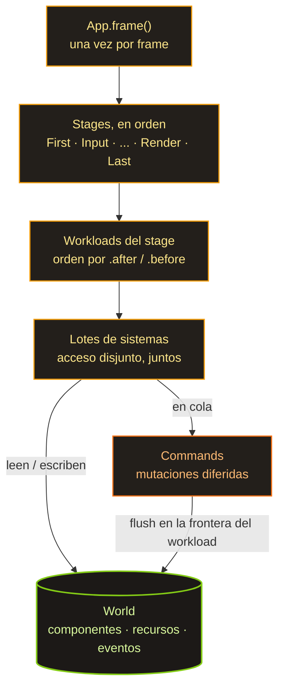

Mi último post sobre Spark terminaba con una pregunta: en qué punto lo dejaría esta vez. Pues bien — todavía no me he rajado. La primera etapa del ECS está hecha: hay una API estable y una implementación ingenua, pero que funciona. El motor todavía no dibuja nada en pantalla, pero el corazón ya le late.

Resumen rápido para quien se saltó [la primera parte](/es/spark/): Spark es mi motor de juegos en Rust donde todo está construido alrededor de un único ECS. La sintaxis de los sistemas se la robo a Bevy, los workloads a Shipyard, y el almacenamiento lo hice a mi manera.

## Un sparse set, no archetipos

La decisión arquitectónica más importante es el almacenamiento, y aquí hay dos grandes bandos. Bevy (y hecs, y flax) usan archetipos: las entidades con el mismo conjunto de componentes van juntas en tablas densas. Shipyard usa un sparse set: cada tipo de componente tiene su propio almacenamiento separado.

Me decanté por un sparse set, como Shipyard, y no por archetipos, como Bevy. La razón es vergonzosamente simple: es más fácil. Los archetipos son más rápidos en el recorrido puro, pero escribirlos desde cero es un género de dolor aparte: entidades migrando entre tablas, fragmentación, todo eso. Y me importaba más entender cada línea que exprimir el último microsegundo. Además, la API está diseñada para poder pasarme a archetipos más adelante sin romper nada por fuera. Pero de eso, al final del todo.

## Cómo se asienta en memoria

El almacenamiento de un componente `T` son tres arrays paralelos:

```text
sparse:        [ Some(0), None, Some(1), None, Some(2) ]
                   E0            E2             E4
dense:         [ Pos0,          Pos2,          Pos4 ]     <- empaquetados sin huecos
entity_index:  [ E0,            E2,            E4   ]
```

`sparse` se indexa por el número de la entidad y te dice dónde viven sus datos en `dense` (o que no hay ninguno). `dense` son los componentes en sí, empaquetados sin huecos. `entity_index` responde a la pregunta inversa: de quién es esta fila en `dense`. Insertar, eliminar, buscar — todo en O(1). Eliminar es un swap-remove: el hueco en `dense` se tapa con el último elemento y se arregla un único puntero en `sparse`. El array sigue denso.

Y aquí está la respuesta a "por qué es rápido siquiera". Cuando un sistema recorre todas las `Position`, lee `dense` de corrido, byte a byte. A la CPU le encanta: el prefetcher adivina lo que viene, y las líneas de caché van llenas de datos útiles en vez de punteros. Compáralo con la OOP clásica, donde tienes un array de punteros a objetos desperdigados por el heap — ahí cada paso del bucle es un viaje a memoria y un fallo de caché. El diseño orientado a datos viene a decir: coloca los datos como los va a leer el procesador, no como le resulta cómodo a un humano. El ECS lleva esa idea hasta el extremo.

## Workloads: un ejemplo real

Un sistema en Spark es una función normal, y sus parámetros declaran qué lee y qué escribe. Un workload es un lote con nombre de sistemas que van juntos:

```rust
// A workload is a named batch of systems. Each system's parameter types
// declare what it reads and writes; the scheduler uses those access sets to
// decide what may share a parallel batch and what must run in order.
app.add_workload(Workload::PowerGrid, Stage::FixedUpdate, |w| {
    // Both write the grid, so they can't share a batch — and an *undeclared*
    // order between two writers is a registration error, not a guess.
    let supply = w.add_system(collect_supply);
    let demand = w.add_system(compute_demand).after(supply);

    // Reads the finished grid, so it runs last.
    w.add_system(distribute_power).after(demand);
})
.after(Workload::Simulation); // whole workloads order by label, same .after / .before
```

El planificador lee los conjuntos de acceso (los declaran los tipos de los parámetros) y decide solo qué choca con qué. Si dos sistemas escriben en el mismo `PowerNetwork` y no se declara un orden entre ellos, eso es un error de registro, no un "bah, ya se apañará". En cambio, los sistemas que tocan datos disjuntos es libre de meterlos en un mismo lote y correrlos en paralelo.

Libre de hacerlo — pero todavía no lo hace. El ejecutor paralelo es M4, aún por llegar, y hoy todo va en secuencia. Pero el modelo de acceso ya está puesto, y no es casualidad: cuando llegue a Rayon, será cambiar un `RefCell` por un `UnsafeCell` detrás de un planificador ya demostrado correcto, no una reescritura.

## Cómo están repartidos los archivos

```text
lib/ecs/
├─ src/
│  ├─ entity.rs       # Entity = (índice, generación) + asignador con lista libre
│  ├─ storage.rs      # ComponentStorage<T> — sparse set + el contador de cambios
│  ├─ world.rs        # World: HashMap<TypeId, Box<dyn AnyStorage>>
│  ├─ query/          # Query<D, F>: datos, filtros, joins, selección de driver
│  ├─ system/         # SystemParam + IntoSystem — una función se vuelve sistema
│  ├─ workload.rs     # workloads: labels, builder, orden topológico
│  ├─ scheduler.rs    # corre stages → workloads → sistemas
│  ├─ commands.rs     # spawn / despawn / insert / remove diferidos
│  ├─ events.rs       # Events<T> + Reader / Writer (doble búfer)
│  └─ access.rs       # conjuntos de acceso + detección de conflictos
└─ macros/            # #[derive(Component / Resource / Event / WorkloadLabel)]
```

## Cómo transcurre un frame



Una vez por frame, `App` le da un toque al planificador. Este recorre los stages en orden estricto; dentro de cada stage, los workloads van en su orden de `.after` / `.before`; dentro de cada workload, los sistemas van en lotes por acceso. Los comandos (`spawn`, `despawn`, `insert`) no se aplican de inmediato: se acumulan y se vuelcan en la frontera del workload. Los eventos viven en un doble búfer y se intercambian una vez al principio del frame, así que un lector siempre ve exactamente el frame anterior y el orden de los sistemas dentro del frame deja de importar. Aburrido y predecible — justo lo que quiere una simulación.

## Detección de cambios: al segundo intento

Una parte de la que estoy contento es la detección de cambios. Los filtros `Changed<T>` y `Added<T>` permiten que un sistema procese solo las entidades cuyo componente cambió (o apareció por primera vez) desde su última pasada. Para una simulación donde de diez mil entidades en un tick se mueven tres de verdad, esa es la diferencia entre "recalcularlo todo" y "recalcular tres".

```rust
// `Query<&mut T>` hands back a `Mut<T>`, not a bare `&mut T`. Taking the
// mutable borrow *is* the change signal: write through it and this entity's
// `changed_tick` moves; read through it and nothing is marked.
fn fluctuate(mut q: Query<&mut BusVoltage>) {
    for mut v in q.iter_mut() {
        v.0 = v.0.wrapping_add(1); // DerefMut here -> this bus is "changed"
    }
}

// Re-solve only the substations whose voltage actually moved this tick.
// `Changed<BusVoltage>` filters to those; the three-component shape already
// drops bare buses before the filter even matters.
fn grid_solver(q: Query<(&BusVoltage, &Transformer, &Feeder), Changed<BusVoltage>>) {
    for (_v, _t, _f) in &q {
        // ... re-solve this substation
    }
}
```

La precisión se sostiene sobre un truquillo. `Query<&mut T>` te devuelve un envoltorio `Mut<T>`, no un `&mut T` pelado, y la señal de "cambiado" es el mero hecho de tomar la referencia mutable a través de `DerefMut`. Recorre mil entidades, escribe en tres y se mueven exactamente tres marcas. Lee solo a través de `Deref` y no se mueve ninguna.

La decisión de la que más orgulloso estoy me costó dos implementaciones. El contador de cambios se puede hacer de dos maneras: un único contador global para todo el `World`, o un contador por cada tipo de componente. El plan original tenía el global. La IA y yo escribimos ambas variantes y las comparamos de frente. Ganaron los contadores por componente — resuelven tres problemas que el modelo global solo rodeaba con advertencias:

- los componentes añadidos antes de que corra ningún sistema son visibles en la primera pasada del sistema (los contadores arrancan en 1, la marca base del lector en 0);
- el driver de un join de tupla no marca las entidades de más que nunca entraron en el join;
- las entidades creadas con `Commands` llegan a una reacción `Added` al frame siguiente.

La variante global no se tiró a la basura — está en una rama aparte, como monumento. Y por el camino resultó que el contador `u32` algún día desbordará, y la comparación ingenua de "tick mayor que la marca base" se rompe sin avisar en ese desbordamiento. Se cura comparando la edad relativa teniendo en cuenta el desbordamiento (`current - tick < current - baseline`). Un clásico del género: la cosa funciona, y luego te pasas media tarde pensando en lo que pasará dentro de cuatro mil millones de ticks.

## Y por cuánto perdemos

Cerrada la primera etapa, monté un banco de pruebas: spark-ecs contra cinco ECS vivos en la misma máquina. Esto es lo esencial (10k entidades, un solo hilo, Apple M4 Pro; menos es mejor):

| métrica | spark | hecs | bevy | shipyard | flax |
|---|---|---|---|---|---|
| iter, µs (lectura) | 18.5 | 6.5 | 6.3 | **5.0** | 6.1 |
| iter_mut, µs (escritura) | 56.4 | 19.5 | 10.2 | 11.0 | **10.0** |
| memoria, B / entidad | 126 | **66** | 145 | 96 | 93 |
| dependencias, crates | 6 | **4** | 59 | 17 | 21 |

En corto: en lectura somos unas 3–4 veces más lentos que los líderes, en escritura unas cinco. Suena a sentencia de muerte. Pero antes de ponerme el cilicio, tres matices:

1. **Esto es de un solo hilo.** Spark aún no tiene planificador paralelo (eso es M4), y el superpoder que define a Bevy — su planificador paralelo — aquí también está apagado. O sea, es una foto honesta de "dónde estoy ahora", pero no es el abismo real respecto a Bevy. Ese se abre en multihilo, que aquí no corre nadie.
2. **Es un test de recorrido puro — el mejor amigo de los archetipos y el peor enemigo de un sparse set.** El escenario para el que se monta un sparse set en primer lugar (insert / remove baratos sin migraciones entre tablas) aquí ni se mide. Así que mi arquitectura todavía no ha jugado su propio partido en casa.
3. **La escritura es más lenta por algo** — cada `&mut` pasa por esa marca `changed_tick`. Es el precio de la detección de cambios, que la mitad de los rivales ni siquiera hacen por defecto.

Y el punto fuerte son las dependencias. Spark se arrastra 6 crates. Bevy, 59. Soy el segundo después de hecs, y eso con todo escrito sobre la librería estándar pelada. En memoria, un sólido puesto a media tabla. Así que para un sparse set ingenuo y hecho desde cero, "tres o cuatro veces más lento en campo ajeno" es, sinceramente, no tan mal.

## Qué viene ahora

El banco de pruebas en sí es el plan. Fija el punto "hoy" para que el trabajo futuro se pueda medir como un delta en la misma máquina, y no a ojo.

Lo siguiente es un inventario detallado de rendimiento: pasar no solo `iter` y `spawn`, sino cada trozo de la API, y volcarlo todo en un informe con números. Y después, una pasada de IA para optimizar, esta vez con esos números en la mano.

La única palanca que tengo clara es M4: Rayon y el ejecutor paralelo. Lo de Stage 24, la mudanza a archetipos, todavía no lo he decidido. Mantuve la API estable desde el primer día justo para dejar esa puerta abierta — pero es una opción, no una promesa. Shipyard, sobre el mismo sparse set, saca cifras muy decentes (en lectura es más rápido que todos los motores de archetipos). O sea que mi déficit es la implementación ingenua, no la arquitectura, así que igual no necesito archetipos para nada — basta con pulir mi sparse set hasta dejarlo fino. ¿Necesito siquiera los archetipos? Aún no lo sé — pero ahora puedo averiguarlo con números y una IA, no a ojo.
