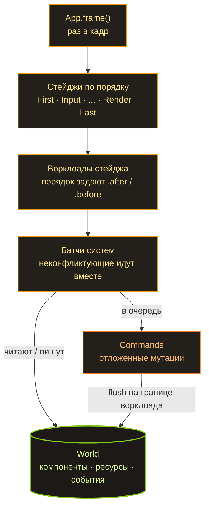

Прошлый пост про Spark закончился вопросом: на каком месте я сольюсь в этот раз. Так вот — пока не слился. Первый этап ECS позади: есть стабильный API и, пускай наивная, но рабочая реализация. Движок ещё ничего не рисует на экране, но сердце у него уже бьётся.

Быстрая вводная для тех, кто пропустил [первую часть](/ru/spark/): Spark — это мой игровой движок на Rust, в котором всё построено вокруг одного ECS. Синтаксис систем я ворую у Bevy, ворклоады — у Shipyard, а вот хранилище сделал по-своему.

## Sparse set, а не архетипы

Самое важное архитектурное решение — это хранилище, и тут два больших лагеря. Bevy (и hecs, и flax) — архетипы: сущности с одинаковым набором компонентов лежат плотными таблицами. Shipyard — sparse set: у каждого типа компонента своё отдельное хранилище.

Я выбрал sparse set, как у Shipyard, а не архетипы, как у Bevy. Причина до неприличия простая: так проще. Архетипы быстрее на чистом обходе, но писать их с нуля — отдельный жанр боли: переезды сущностей между таблицами, фрагментация, вот это всё. А мне важнее было понять каждую строчку, чем выжать максимум. К тому же API спроектирован так, что на архетипы можно переехать потом, ничего снаружи не сломав. Но об этом в самом конце.

## Как это лежит в памяти

Хранилище одного компонента `T` — это три параллельных массива:

```text
sparse:        [ Some(0), None, Some(1), None, Some(2) ]
                   E0            E2             E4
dense:         [ Pos0,          Pos2,          Pos4 ]     <- упакованы подряд
entity_index:  [ E0,            E2,            E4   ]
```

`sparse` индексируется номером сущности и говорит, где её данные лежат в `dense` (или что их нет вовсе). `dense` — это сами компоненты, упакованные подряд, без дыр. `entity_index` отвечает на обратный вопрос: чья это запись в `dense`. Вставка, удаление, поиск — всё за O(1). Удаление — это swap-remove: дырку в `dense` затыкаем последним элементом и чиним один указатель в `sparse`. Массив остаётся плотным.

И вот тут — ответ на вопрос, за счёт чего оно вообще работает быстро. Когда система идёт по всем `Position`, она читает `dense` подряд, байт за байтом. Процессор это обожает: префетчер угадывает, что будет дальше, кеш-линии забиты полезными данными, а не указателями. Сравните с классическим ООП, где у вас массив указателей на объекты, разбросанные по куче, — там каждый шаг цикла это поход в память и промах кеша. Data-oriented подход, по сути, говорит: «разложи данные так, как их будет читать процессор, а не так, как удобно человеку». ECS доводит эту мысль до абсолюта.

## Ворклоады: реальный пример

Система в Spark — это обычная функция, а её параметры объявляют, что она читает и что пишет. Ворклоад — именованная пачка систем, которые работают вместе:

```rust
// A workload is a named batch of systems. Each system's parameter types
// declare what it reads and writes; the scheduler uses those access sets to
// decide what may share a parallel batch and what must run in order.
app.add_workload(Workload::PowerGrid, Stage::FixedUpdate, |w| {
    // Both write the grid, so they can't share a batch — and an *undeclared*
    // order between two writers is a registration error, not a guess.
    let supply = w.add_system(collect_supply);
    let demand = w.add_system(compute_demand).after(supply);

    // Reads the finished grid, so it runs last.
    w.add_system(distribute_power).after(demand);
})
.after(Workload::Simulation); // whole workloads order by label, same .after / .before
```

Планировщик читает множества доступа (их задают типы параметров) и сам решает, что с чем конфликтует. Если две системы пишут в один и тот же `PowerNetwork`, а порядок между ними не объявлен, — это ошибка регистрации, а не «ну, как-нибудь разрулится». Зато системы, которые трогают непересекающиеся данные, он имеет полное право собрать в один батч и запустить параллельно.

Имеет право — но пока не делает. Параллельный исполнитель — это M4, он ещё впереди, и сегодня всё крутится последовательно. Но модель доступа уже на месте, и это не случайно: когда дойдут руки до Rayon, это будет замена `RefCell` на `UnsafeCell` за уже доказанно корректным планировщиком, а не переписывание с нуля.

## Как разложены файлы

```text
lib/ecs/
├─ src/
│  ├─ entity.rs       # Entity = (индекс, поколение) + аллокатор со свободным списком
│  ├─ storage.rs      # ComponentStorage<T> — sparse set + счётчик изменений
│  ├─ world.rs        # World: HashMap<TypeId, Box<dyn AnyStorage>>
│  ├─ query/          # Query<D, F>: данные, фильтры, джойны, выбор драйвера
│  ├─ system/         # SystemParam + IntoSystem — функция становится системой
│  ├─ workload.rs     # ворклоады: лейблы, билдер, топосорт
│  ├─ scheduler.rs    # гоняет стейджи → ворклоады → системы
│  ├─ commands.rs     # отложенные spawn / despawn / insert / remove
│  ├─ events.rs       # Events<T> + Reader / Writer (двойная буферизация)
│  └─ access.rs       # множества доступа + детект конфликтов
└─ macros/            # #[derive(Component / Resource / Event / WorkloadLabel)]
```

## Как проходит кадр



Раз в кадр `App` дёргает планировщик. Тот проходит стейджи строго по порядку, в каждом стейдже — ворклоады в порядке их `.after` / `.before`, в каждом ворклоаде — системы, разбитые на батчи по доступу. Команды (`spawn`, `despawn`, `insert`) не применяются сразу: они копятся и сбрасываются на границе ворклоада. События живут в двойном буфере и переключаются один раз в начале кадра — так читатель всегда видит ровно прошлый кадр, и порядок систем внутри кадра уже ни на что не влияет. Скучно и предсказуемо — ровно то, что нужно симуляции.

## Детект изменений: со второй попытки

Отдельная история, которой я доволен, — это change detection. Фильтры `Changed<T>` и `Added<T>` позволяют системе обработать только те сущности, чей компонент изменился (или впервые появился) с её прошлого запуска. Для симуляции, где из десяти тысяч сущностей за тик реально меняются три, это разница между «пересчитать всё» и «пересчитать три».

```rust
// `Query<&mut T>` hands back a `Mut<T>`, not a bare `&mut T`. Taking the
// mutable borrow *is* the change signal: write through it and this entity's
// `changed_tick` moves; read through it and nothing is marked.
fn fluctuate(mut q: Query<&mut BusVoltage>) {
    for mut v in q.iter_mut() {
        v.0 = v.0.wrapping_add(1); // DerefMut here -> this bus is "changed"
    }
}

// Re-solve only the substations whose voltage actually moved this tick.
// `Changed<BusVoltage>` filters to those; the three-component shape already
// drops bare buses before the filter even matters.
fn grid_solver(q: Query<(&BusVoltage, &Transformer, &Feeder), Changed<BusVoltage>>) {
    for (_v, _t, _f) in &q {
        // ... re-solve this substation
    }
}
```

Точность тут держится на маленьком трюке. `Query<&mut T>` отдаёт не голый `&mut T`, а обёртку `Mut<T>`, и сигналом «изменилось» считается сам факт взятия мутабельной ссылки через `DerefMut`. Прошёлся по тысяче сущностей, записал в три — сдвинулись ровно три отметки. Только читал через `Deref` — не сдвинулось ничего.

Решение, которым я горжусь больше всего, стоило двух реализаций. Счётчик изменений можно сделать двумя способами: один глобальный счётчик на весь `World` или свой счётчик у каждого типа компонента. В исходном плане были глобальные. Мы с ИИ написали оба варианта и сравнили их в лоб. Победили per-component счётчики — они решают три проблемы, вокруг которых глобальная модель только расставляла предупреждения:

- компоненты, навешенные до первого запуска систем, видны системе на её первом же прогоне (счётчики стартуют с 1, базовая отметка читателя — 0);
- драйвер тапл-джойна не помечает лишние сущности, которые в джойн и не попали;
- сущности, заспавненные через `Commands`, доходят до `Added`-реакции следующим кадром.

Глобальный вариант не выбросили — он лежит на отдельной ветке как памятник. А ещё по дороге выяснилось, что `u32`-счётчик однажды переполнится, и наивное сравнение «тик больше базовой отметки» на этом переполнении тихо ломается. Лечится сравнением относительного возраста с учётом переполнения (`current - tick < current - baseline`). Классика жанра: фича работает, а потом ты полдня думаешь о том, что случится через четыре миллиарда тиков.

## И насколько мы проигрываем

Закрыв первый этап, я собрал стендовый бенчмарк: spark-ecs против пяти живых ECS на одной машине. Вот суть (10k сущностей, один поток, Apple M4 Pro; меньше — лучше):

| метрика | spark | hecs | bevy | shipyard | flax |
|---|---|---|---|---|---|
| iter, µs (чтение) | 18.5 | 6.5 | 6.3 | **5.0** | 6.1 |
| iter_mut, µs (запись) | 56.4 | 19.5 | 10.2 | 11.0 | **10.0** |
| память, Б / сущность | 126 | **66** | 145 | 96 | 93 |
| зависимости, крейтов | 6 | **4** | 59 | 17 | 21 |

Если коротко: на чтении мы примерно в 3–4 раза медленнее лидеров, на записи — раз в пять. Звучит как приговор. Но прежде чем посыпать голову пеплом, три оговорки:

1. **Это один поток.** Параллельного планировщика у Spark ещё нет (он же M4), а у Bevy его главная суперсила — параллельный шедулер — здесь тоже выключена. То есть это честный срез «где я сейчас», но это не та самая пропасть до Bevy. Она откроется на многопотоке, которого тут нет ни у кого.
2. **Это тест на чистый обход — лучший друг архетипов и худший враг sparse set.** Сценарий, ради которого sparse set вообще затевается (дешёвые insert / remove без переездов между таблицами), здесь не измеряется вообще. Так что свой главный матч моя архитектура ещё даже не играла.
3. **Запись медленнее не просто так** — каждое `&mut` проходит через ту самую отметку `changed_tick`. Это плата за change detection, которого у половины соперников по умолчанию просто нет.

А там, где я реально рад, — это зависимости. Spark тащит за собой 6 крейтов. Bevy — 59. Я второй после hecs, и это при том, что всё написано на голой стандартной библиотеке. По памяти — крепкий середняк. Так что для наивного, написанного с нуля sparse set «в три-четыре раза медленнее на чужом поле» — это, в общем-то, не так уж плохо.

## Что дальше

Сам бенчмарк — это и есть план. Он фиксирует точку «сегодня», чтобы будущую работу можно было мерить как дельту на той же машине, а не на ощущениях.

Дальше — подробная инвентаризация производительности: прогнать не только iter и spawn, а каждый кусок API, и сложить всё в отчёт с цифрами. А потом — проход ИИ по оптимизации, уже с этими цифрами на руках.

Главный известный рычаг — M4: Rayon и параллельный исполнитель. А вот Stage 24, переезд на архетипы, я пока не решил. API я держал стабильным с самого начала ровно ради такой возможности — но это возможность, а не обещание. Shipyard на том же sparse set выдаёт очень приличные цифры (на чтении он вообще быстрее всех архетипных движков). То есть отстаю я из-за наивной реализации, а не из-за архитектуры — так что, может, никакие архетипы мне и не нужны, достаточно довести до ума свой sparse set. Нужны ли мне эти архетипы вообще? Пока не знаю — но теперь это можно выяснить с цифрами и ИИ, а не гадать.
