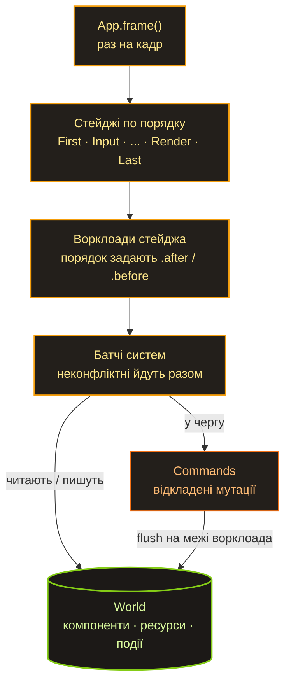

Минулий пост про Spark закінчився питанням: на якому місці я здуюся цього разу. Так от — поки не здувся. Перший етап ECS позаду: є стабільний API і, хай наївна, але робоча реалізація. Рушій ще нічого не малює на екрані, але серце в нього вже бʼється.

Швидка вступна для тих, хто пропустив [першу частину](/uk/spark/): Spark — це мій ігровий рушій на Rust, у якому все побудовано навколо одного ECS. Синтаксис систем я краду в Bevy, ворклоади — у Shipyard, а от сховище зробив по-своєму.

## Sparse set, а не архетипи

Найважливіше архітектурне рішення — це сховище, і тут два великі табори. Bevy (і hecs, і flax) — архетипи: сутності з однаковим набором компонентів лежать щільними таблицями. Shipyard — sparse set: у кожного типу компонента своє окреме сховище.

Я обрав sparse set, як у Shipyard, а не архетипи, як у Bevy. Причина до неподобства проста: так простіше. Архетипи швидші на чистому обході, але писати їх з нуля — окремий жанр болю: переїзди сутностей між таблицями, фрагментація, усе це. А мені важливіше було зрозуміти кожен рядок, ніж вичавити максимум. До того ж API спроєктовано так, що на архетипи можна переїхати потім, нічого зовні не зламавши. Але про це в самому кінці.

## Як це лежить у памʼяті

Сховище одного компонента `T` — це три паралельні масиви:

```text
sparse:        [ Some(0), None, Some(1), None, Some(2) ]
                   E0            E2             E4
dense:         [ Pos0,          Pos2,          Pos4 ]     <- упаковані поспіль
entity_index:  [ E0,            E2,            E4   ]
```

`sparse` індексується номером сутності й каже, де її дані лежать у `dense` (чи що їх немає взагалі). `dense` — це самі компоненти, упаковані поспіль, без дірок. `entity_index` відповідає на зворотне питання: чий це запис у `dense`. Вставка, видалення, пошук — усе за O(1). Видалення — це swap-remove: дірку в `dense` затикаємо останнім елементом і лагодимо один вказівник у `sparse`. Масив лишається щільним.

І ось тут — відповідь на питання, за рахунок чого воно взагалі працює швидко. Коли система йде по всіх `Position`, вона читає `dense` поспіль, байт за байтом. Процесор це обожнює: префетчер угадує, що буде далі, а кеш-лінії напхані корисними даними, а не вказівниками. Порівняйте з класичним ООП, де у вас масив вказівників на обʼєкти, розкидані по купі, — там кожен крок циклу це похід у памʼять і промах кешу. Data-oriented підхід, по суті, каже: розклади дані так, як їх читатиме процесор, а не так, як зручно людині. ECS доводить цю думку до абсолюту.

## Ворклоади: реальний приклад

Система в Spark — це звичайна функція, а її параметри оголошують, що вона читає і що пише. Ворклоад — іменована пачка систем, які працюють разом:

```rust
// A workload is a named batch of systems. Each system's parameter types
// declare what it reads and writes; the scheduler uses those access sets to
// decide what may share a parallel batch and what must run in order.
app.add_workload(Workload::PowerGrid, Stage::FixedUpdate, |w| {
    // Both write the grid, so they can't share a batch — and an *undeclared*
    // order between two writers is a registration error, not a guess.
    let supply = w.add_system(collect_supply);
    let demand = w.add_system(compute_demand).after(supply);

    // Reads the finished grid, so it runs last.
    w.add_system(distribute_power).after(demand);
})
.after(Workload::Simulation); // whole workloads order by label, same .after / .before
```

Планувальник читає множини доступу (їх задають типи параметрів) і сам вирішує, що з чим конфліктує. Якщо дві системи пишуть в один і той самий `PowerNetwork`, а порядок між ними не оголошено, — це помилка реєстрації, а не «та якось воно владнається». Зате системи, що чіпають неперетинні дані, він має повне право зібрати в один батч і запустити паралельно.

Має право — але поки не робить. Паралельний виконавець — це M4, він ще попереду, і сьогодні все крутиться послідовно. Але модель доступу вже на місці, і це невипадково: коли дійдуть руки до Rayon, це буде заміна `RefCell` на `UnsafeCell` за вже доведено коректним планувальником, а не переписування з нуля.

## Як розкладено файли

```text
lib/ecs/
├─ src/
│  ├─ entity.rs       # Entity = (індекс, покоління) + алокатор із вільним списком
│  ├─ storage.rs      # ComponentStorage<T> — sparse set + лічильник змін
│  ├─ world.rs        # World: HashMap<TypeId, Box<dyn AnyStorage>>
│  ├─ query/          # Query<D, F>: дані, фільтри, джойни, вибір драйвера
│  ├─ system/         # SystemParam + IntoSystem — функція стає системою
│  ├─ workload.rs     # ворклоади: лейбли, білдер, топосорт
│  ├─ scheduler.rs    # ганяє стейджі → ворклоади → системи
│  ├─ commands.rs     # відкладені spawn / despawn / insert / remove
│  ├─ events.rs       # Events<T> + Reader / Writer (подвійна буферизація)
│  └─ access.rs       # множини доступу + детект конфліктів
└─ macros/            # #[derive(Component / Resource / Event / WorkloadLabel)]
```

## Як проходить кадр



Раз на кадр `App` смикає планувальник. Той проходить стейджі строго по порядку, у кожному стейджі — ворклоади в порядку їхніх `.after` / `.before`, у кожному ворклоаді — системи, розбиті на батчі за доступом. Команди (`spawn`, `despawn`, `insert`) не застосовуються одразу: вони накопичуються і скидаються на межі ворклоада. Події живуть у подвійному буфері й перемикаються один раз на початку кадру — так читач завжди бачить рівно минулий кадр, і порядок систем усередині кадру вже ні на що не впливає. Нудно й передбачувано — рівно те, що потрібно симуляції.

## Детект змін: з другої спроби

Окрема історія, якою я задоволений, — це change detection. Фільтри `Changed<T>` і `Added<T>` дають змогу системі обробити лише ті сутності, чий компонент змінився (чи вперше зʼявився) з її минулого запуску. Для симуляції, де з десяти тисяч сутностей за тік реально змінюються три, це різниця між «перерахувати все» і «перерахувати три».

```rust
// `Query<&mut T>` hands back a `Mut<T>`, not a bare `&mut T`. Taking the
// mutable borrow *is* the change signal: write through it and this entity's
// `changed_tick` moves; read through it and nothing is marked.
fn fluctuate(mut q: Query<&mut BusVoltage>) {
    for mut v in q.iter_mut() {
        v.0 = v.0.wrapping_add(1); // DerefMut here -> this bus is "changed"
    }
}

// Re-solve only the substations whose voltage actually moved this tick.
// `Changed<BusVoltage>` filters to those; the three-component shape already
// drops bare buses before the filter even matters.
fn grid_solver(q: Query<(&BusVoltage, &Transformer, &Feeder), Changed<BusVoltage>>) {
    for (_v, _t, _f) in &q {
        // ... re-solve this substation
    }
}
```

Точність тут тримається на маленькому трюку. `Query<&mut T>` віддає не голий `&mut T`, а обгортку `Mut<T>`, і сигналом «змінилося» вважається сам факт узяття мутабельного посилання через `DerefMut`. Пройшовся по тисячі сутностей, записав у три — зрушили рівно три позначки. Тільки читав через `Deref` — не зрушило нічого.

Рішення, яким я пишаюся найбільше, коштувало двох реалізацій. Лічильник змін можна зробити двома способами: один глобальний лічильник на весь `World` або свій лічильник у кожного типу компонента. У початковому плані були глобальні. Ми з ШІ написали обидва варіанти й порівняли їх у лоб. Перемогли per-component лічильники — вони розвʼязують три проблеми, навколо яких глобальна модель лише розставляла попередження:

- компоненти, навішені до першого запуску систем, видно системі на її першому ж проході (лічильники стартують з 1, базова позначка читача — 0);
- драйвер тапл-джойна не позначає зайві сутності, які в джойн і не потрапили;
- сутності, заспавнені через `Commands`, доходять до `Added`-реакції наступним кадром.

Глобальний варіант не викинули — він лежить на окремій гілці як памʼятник. А ще дорогою зʼясувалося, що `u32`-лічильник колись переповниться, і наївне порівняння «тік більший за базову позначку» на цьому переповненні тихо ламається. Лікується порівнянням відносного віку з урахуванням переповнення (`current - tick < current - baseline`). Класика жанру: фіча працює, а потім ти півдня думаєш про те, що станеться через чотири мільярди тіків.

## І наскільки ми програємо

Закривши перший етап, я зібрав стендовий бенчмарк: spark-ecs проти пʼяти живих ECS на одній машині. Ось суть (10k сутностей, один потік, Apple M4 Pro; менше — краще):

| метрика | spark | hecs | bevy | shipyard | flax |
|---|---|---|---|---|---|
| iter, µs (читання) | 18.5 | 6.5 | 6.3 | **5.0** | 6.1 |
| iter_mut, µs (запис) | 56.4 | 19.5 | 10.2 | 11.0 | **10.0** |
| памʼять, Б / сутність | 126 | **66** | 145 | 96 | 93 |
| залежності, крейтів | 6 | **4** | 59 | 17 | 21 |

Якщо коротко: на читанні ми приблизно в 3–4 рази повільніші за лідерів, на записі — разів у пʼять. Звучить як вирок. Але перш ніж посипати голову попелом, три застереження:

1. **Це один потік.** Паралельного планувальника у Spark ще немає (він же M4), а в Bevy його головна суперсила — паралельний шедулер — тут теж вимкнена. Тобто це чесний зріз «де я зараз», але це не та сама прірва до Bevy. Вона відкриється на багатопотоці, якого тут немає ні в кого.
2. **Це тест на чистий обхід — найкращий друг архетипів і найгірший ворог sparse set.** Сценарій, заради якого sparse set узагалі затівається (дешеві insert / remove без переїздів між таблицями), тут не вимірюється взагалі. Тож свій головний матч моя архітектура ще навіть не грала.
3. **Запис повільніший не просто так** — кожне `&mut` проходить через ту саму позначку `changed_tick`. Це плата за change detection, якого в половини суперників за замовчуванням просто немає.

А ось що мене реально тішить — залежності. Spark тягне за собою 6 крейтів. Bevy — 59. Я другий після hecs, і це при тому, що все написано на голій стандартній бібліотеці. По памʼяті — міцний середняк. Тож для наївного, написаного з нуля sparse set «у три-чотири рази повільніше на чужому полі» — це, загалом-то, не так уже й погано.

## Що далі

Сам бенчмарк — це і є план. Він фіксує точку «сьогодні», щоб майбутню роботу можна було міряти як дельту на тій самій машині, а не на відчуттях.

Далі — детальна інвентаризація продуктивності: прогнати не лише iter і spawn, а кожен шматок API, і скласти все у звіт із цифрами. А потім — прохід ШІ з оптимізації, уже з цими цифрами на руках.

Головний відомий важіль — M4: Rayon і паралельний виконавець. А от Stage 24, переїзд на архетипи, я поки не вирішив. API я тримав стабільним із самого початку саме заради такої можливості — але це можливість, а не обіцянка. Shipyard на тому самому sparse set видає дуже пристойні цифри (на читанні він узагалі швидший за всі архетипні рушії). Тобто відстаю я через наївну реалізацію, а не через архітектуру — тож, може, ніякі архетипи мені й не потрібні, досить довести до пуття власний sparse set. Чи потрібні мені ці архетипи взагалі? Поки не знаю — але тепер це можна зʼясувати з цифрами і ШІ, а не гадати.
