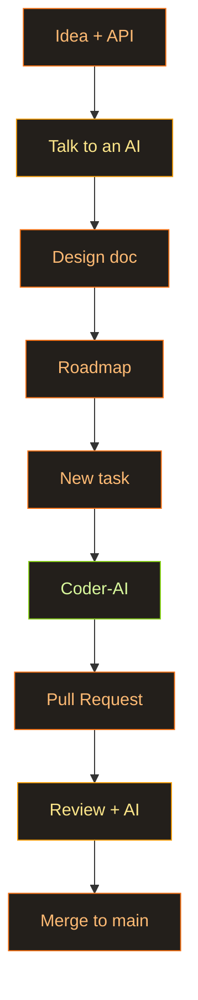

My son and I rewatched HBO's *Chernobyl* a while back. The show's dramatised to the hilt, of course, and plenty of it is flat-out invented (the heroic divers, the rest of the tall tales). But even through all the drama, you can see how fiendishly complicated the whole thing is. It got me curious, so I went further: a couple of YouTube videos on how power grids are actually run and balanced. And it hit me: damn, this is hard — keeping that whole machine in balance. Properly hard. To us, electricity is a switch on the wall, the most ordinary thing there is. Getting anything to happen behind that switch took decades of evolution, just so the lights stay on and the house stays warm.

I wanted to climb into the skin of the people who live inside all that and actually understand it. So an idea was born: make a game about power grids. I called it [Spark](https://github.com/AlexTiTanium/spark).

## But just making games is boring

Just grinding out a game bores me. I want to experiment with AI on the side and learn something myself in the process. I've taken runs at this before (a game engine in Rust), so why not resurrect it. My first project bored me at the exact moment I reached the renderer: I slammed into a wall of problems with the Shipyard ECS. It was never built to be used like that.

## My brilliantly dumb idea

And here comes my favourite genre of idea: brilliantly dumb, as usual. What if I threw out almost the whole engine, every last bit of its API, and replaced it with one single ECS? Sounds unhinged, I know.

Let everything in the engine be one of three things. There are components, and there are loads of them. A resource is the thing there's exactly one of. Systems are where all the logic lives. And then the fun part: the renderer, the asset manager, the camera, the audio are just resources too. Any system that needs one simply asks for it by name. One world, one set of rules for everything.

Since every system says up front what it reads and writes, I can build a scheduler that scatters the non-overlapping tasks across threads, and the whole thing runs in parallel on its own. Which is exactly why the ECS ended up the heart of the engine rather than just one of its parts.

In code it looks roughly like this. No "engine object" with methods — there's a `World`, and everything lives in it:

```rust
// In Spark there is no "engine object" with methods. There is a World, and
// everything lives inside it — as a Resource (one of a kind) or an Entity
// (many of a kind). The renderer, the GPU, the input, the power grid: all
// just Resources. Nothing hidden away in global statics.

#[derive(Resource)]
struct RenderContext {
    device: wgpu::Device,
    queue: wgpu::Queue,
    surface: wgpu::Surface<'static>,
}

#[derive(Resource, Default)]
struct PowerNetwork {
    supply: f32,
    demand: f32,
    ratio: f32,
}

// A system is just a function. Its parameters declare what it touches —
// and the scheduler hands it exactly that, nothing more.
fn balance_grid(mut grid: ResMut<PowerNetwork>) {
    grid.ratio = grid.supply / grid.demand.max(1.0);
}
```

## Why not just take Bevy or Shipyard

Fair question: why build my own when [Bevy](https://github.com/bevyengine/bevy/tree/main/crates/bevy_ecs) and [Shipyard](https://github.com/leudz/shipyard) exist. I love Bevy's syntax — it's noticeably more logical than Shipyard's. But Shipyard has workloads, and those are done beautifully. And I plain cannot choose.

Bevy's also a monster. And Shipyard's no picnic either. And the day I need something that isn't there and isn't supported, no AI is going to pull it out for me — because I don't even roughly know how these things work on the inside. Which is the real reason for the whole exercise: I want to understand. At least at the level of the data structures and the decisions the authors of such libraries make. Why it runs so fast. What compromises they made to get there.

Here's the same thing in both. Bevy:

```rust
// Bevy — a system is a plain function; you ask for data by its type.
fn movement(mut query: Query<(&mut Position, &Velocity)>) {
    for (mut pos, vel) in &mut query {
        pos.x += vel.x;
        pos.y += vel.y;
    }
}

let mut schedule = Schedule::default();
schedule.add_systems(movement);
```

Shipyard:

```rust
// Shipyard — a system takes "views" into storages, then iterates them.
fn movement(mut positions: ViewMut<Position>, velocities: View<Velocity>) {
    for (mut pos, vel) in (&mut positions, &velocities).iter() {
        pos.x += vel.x;
        pos.y += vel.y;
    }
}

world.run(movement);
```

And here are the workloads from Shipyard I want to steal. You name a batch of systems, hand it to the world, and it works out from the "views" which systems can run in parallel:

```rust
// Shipyard workloads — name a batch of systems, add it to the world, and it
// works out which ones can run in parallel from the views they borrow.
Workload::new("simulation")
    .with_system(movement)
    .with_system(collide)
    .add_to_world(&world)
    .unwrap();

world.run_workload("simulation").unwrap();
```

So Spark robs them both. Bevy's function-systems, Shipyard's named workloads:

```rust
// Spark steals from both: Bevy's function-systems, Shipyard's named workloads.
// Because every system spells out what it reads and writes, the scheduler can
// batch the ones that don't collide and run them on separate threads.
app.add_workload(Workload::PowerGrid, Schedule::FixedUpdate, |w| {
    w.add(collect_supply);                      // reads plants
    w.add(compute_demand);                      // reads cities — runs in parallel
    w.add(distribute_power).after_all_prior();  // needs both, so it waits
});
```

## A different approach than Moku

My son showed an interest too — he might end up taking part in something. And I want to come at this project from a different angle. If [Moku](https://github.com/moku-labs/core) is the story where code generation sits at the centre (fire off a prompt, go watch a show), here I want the exact opposite. To climb into the code it generates. To understand, at least in part, why it picks one solution over another. How it sits in memory. And to design an API I personally consider right. Most likely that same mix of Bevy and Shipyard.

I'm also curious to see how the models write Rust. At TypeScript, frankly, they're so-so.

## How the development actually works

I'm doing it in stages, and there's one principle the whole thing rests on. First we kick the general idea around — goals, a rough API. That conversation turns into a design document: ECS, renderer, asset server, the lot. Then a roadmap, sliced into stages. A task gets filed, and the AI takes on the implementation. When the PR is ready I look it over, try to understand it, talk it through with an AI to make sure I really get how and why it works (or doesn't). I propose edits. I accept, we merge, on to the next task. A plan is good. A false sense of control.

Codex or Claude Code only ever touch the code, nothing else. All the discussion happens with ordinary, non-code agents. Why it matters: I don't want the agent I'm hashing decisions out with to know anything about the code, or to dig into it and clog its context. Let it talk things through with me, not reach in to "fix" things and, as usual, break them.



---

## Let's see where I tap out

So, an ambitious plan. Let's see where I fold this time. Last time it was the second implementation of a WebGPU renderer. Will I get any further?
