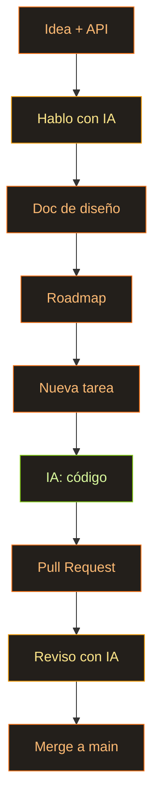

Mi hijo y yo revisitamos *Chernobyl* de HBO hace poco. La serie está dramatizada hasta las cejas, claro, y buena parte es directamente inventada (la heroica historia de los buzos, para empezar). Pero hasta a través de todo el drama se ve lo enrevesado que es el asunto. Me picó la curiosidad, así que fui más allá: un par de vídeos en YouTube sobre cómo se gestionan y se equilibran de verdad las redes eléctricas. Y me cayó la ficha: joder, qué difícil es esto — mantener toda esa maquinaria en equilibrio. Difícil de verdad. Para nosotros la electricidad es un interruptor en la pared, la cosa más normal del mundo. Que pase algo detrás de ese interruptor costó décadas de evolución, solo para que tengamos luz y calor en casa.

Me entraron ganas de meterme en la piel de la gente que vive dentro de todo eso y de verdad lo entiende. Y así nació la idea: hacer un juego sobre redes eléctricas. Lo llamé [Spark](https://github.com/AlexTiTanium/spark).

## Pero hacer juegos a secas aburre

Limitarme a fabricar un juego me aburre. Quiero de paso experimentar con la IA y aprender yo algo en el proceso. Ya le he tirado los tejos a esto antes (un motor en Rust), así que por qué no resucitarlo. Mi primer proyecto me aburrió justo en el momento en que llegué al render: me estampé contra un muro de problemas con el ECS de Shipyard. Nunca se diseñó para usarlo así.

## Mi idea genialmente tonta

Y aquí llega mi género de idea favorito: genialmente tonta, como siempre. ¿Y si tiro casi todo el motor, hasta el último trozo de su API, y lo reemplazo por un único ECS? Suena demencial, lo sé.

Que todo en el motor sea una de tres cosas. Componentes, que hay un montón. Recursos, de los que hay exactamente uno. Sistemas, donde vive toda la lógica. Y luego lo divertido: el render, el gestor de assets, la cámara, el audio son recursos también. Cualquier sistema que necesite uno simplemente lo pide por su nombre. Un mundo, un mismo conjunto de reglas para todo.

Como cada sistema dice de antemano qué lee y qué escribe, puedo montar un planificador que reparta las tareas que no se pisan entre varios hilos, y todo corre en paralelo solo. Que es justo por lo que el ECS acabó siendo el corazón del motor y no una pieza más.

En código se ve más o menos así. Ningún «objeto motor» con métodos — hay un `World`, y dentro vive todo:

```rust
// In Spark there is no "engine object" with methods. There is a World, and
// everything lives inside it — as a Resource (one of a kind) or an Entity
// (many of a kind). The renderer, the GPU, the input, the power grid: all
// just Resources. Nothing hidden away in global statics.

#[derive(Resource)]
struct RenderContext {
    device: wgpu::Device,
    queue: wgpu::Queue,
    surface: wgpu::Surface<'static>,
}

#[derive(Resource, Default)]
struct PowerNetwork {
    supply: f32,
    demand: f32,
    ratio: f32,
}

// A system is just a function. Its parameters declare what it touches —
// and the scheduler hands it exactly that, nothing more.
fn balance_grid(mut grid: ResMut<PowerNetwork>) {
    grid.ratio = grid.supply / grid.demand.max(1.0);
}
```

## Por qué no coger algo hecho — Bevy o Shipyard

Pregunta justa: para qué montar lo mío si existen [Bevy](https://github.com/bevyengine/bevy/tree/main/crates/bevy_ecs) y [Shipyard](https://github.com/leudz/shipyard). Me encanta la sintaxis de Bevy — es bastante más lógica que la de Shipyard. Pero Shipyard tiene workloads, y eso está hecho de maravilla. Y no hay manera de que me decida.

Bevy, además, es enorme. Y Shipyard tampoco es moco de pavo. Y el día que necesite algo que no está y que no se soporta, no habrá IA que me lo saque — porque no tengo ni idea, ni de lejos, de cómo funcionan estas cosas por dentro. Que es la razón de verdad de todo el asunto: quiero entender. Al menos a nivel de las estructuras de datos y de las decisiones que toman los autores de bibliotecas así. Por qué corre tan rápido. Qué concesiones hicieron para llegar ahí.

Aquí está lo mismo en ambos. Bevy:

```rust
// Bevy — a system is a plain function; you ask for data by its type.
fn movement(mut query: Query<(&mut Position, &Velocity)>) {
    for (mut pos, vel) in &mut query {
        pos.x += vel.x;
        pos.y += vel.y;
    }
}

let mut schedule = Schedule::default();
schedule.add_systems(movement);
```

Shipyard:

```rust
// Shipyard — a system takes "views" into storages, then iterates them.
fn movement(mut positions: ViewMut<Position>, velocities: View<Velocity>) {
    for (mut pos, vel) in (&mut positions, &velocities).iter() {
        pos.x += vel.x;
        pos.y += vel.y;
    }
}

world.run(movement);
```

Y aquí están esos workloads de Shipyard que quiero mangar. Le pones nombre a un grupo de sistemas, se lo das al mundo, y él solo deduce de las «vistas» qué sistemas pueden correr en paralelo:

```rust
// Shipyard workloads — name a batch of systems, add it to the world, and it
// works out which ones can run in parallel from the views they borrow.
Workload::new("simulation")
    .with_system(movement)
    .with_system(collide)
    .add_to_world(&world)
    .unwrap();

world.run_workload("simulation").unwrap();
```

Así que Spark, en el fondo, roba a los dos. La sintaxis de sistemas — de Bevy, los workloads con nombre — de Shipyard:

```rust
// Spark steals from both: Bevy's function-systems, Shipyard's named workloads.
// Because every system spells out what it reads and writes, the scheduler can
// batch the ones that don't collide and run them on separate threads.
app.add_workload(Workload::PowerGrid, Schedule::FixedUpdate, |w| {
    w.add(collect_supply);                      // reads plants
    w.add(compute_demand);                      // reads cities — runs in parallel
    w.add(distribute_power).after_all_prior();  // needs both, so it waits
});
```

## Un enfoque distinto al de Moku

Mi hijo también mostró interés — igual acaba metiéndose en algo. Y con este proyecto quiero entrar por otro lado. Si [Moku](https://github.com/moku-labs/core) es la historia donde la generación de código está en el centro (lanzas el prompt y te vas a ver una serie), aquí quiero justo lo contrario. Meterme en el código que genera. Entender, al menos en parte, por qué elige una solución y no otra. Cómo queda en memoria. Y diseñar una API que yo personalmente considere correcta. Lo más seguro, esa misma mezcla de Bevy y Shipyard.

De paso tengo curiosidad por ver cómo escriben Rust los modelos. En TypeScript, la verdad, van regular.

## Cómo funciona el desarrollo en sí

Lo hago por etapas, y aquí hay un principio sobre el que se sostiene todo. Primero le damos vueltas a la idea general — objetivos, una API en borrador. De esa charla nace un documento de diseño: ECS, render, servidor de assets y demás. Luego un roadmap, cortado en etapas. Se abre una tarea, y la IA se encarga de implementarla. Cuando el PR está listo lo reviso, intento entenderlo, lo hablo con una IA para asegurarme de que de verdad pillo cómo y por qué funciona. O no funciona. Propongo cambios. Acepto, hacemos merge, a la siguiente. Un plan está bien. Una falsa sensación de control.

El código solo lo escriben Codex o Claude Code, y nada más que código. Toda la discusión ocurre con agentes normales, los que no tocan código. Y por qué importa: no quiero que el agente con el que discuto las decisiones sepa nada del código, ni que se meta a fondo en él y le atasque el contexto. Que lo hable conmigo, no que entre a «arreglar» y, como de costumbre, romper.



---

## A ver en qué punto lo dejo

En fin, un plan ambicioso. A ver dónde me rajo esta vez. La última fue la segunda implementación de un render en WebGPU. ¿Llegaré más lejos?
