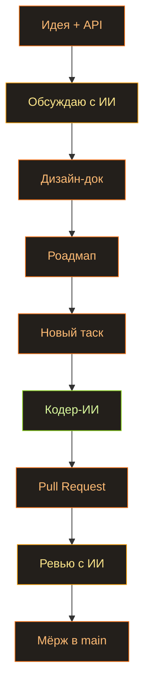

Мы с сыном недавно пересмотрели «Чернобыль» от HBO. Сериал, конечно, дико приукрашен и местами просто выдуман (одни байки про водолазов чего стоят). Но даже сквозь всю драму видно, как там всё непросто устроено. Меня зацепило, и я пошёл дальше — посмотрел пару роликов на YouTube про то, как вообще устроены и работают энергосети. И до меня дошло, какая же это сложная штука — держать всю эту махину в балансе. Реально сложно. Электричество для нас — просто выключатель на стене, самая обычная вещь. А чтобы за этим выключателем что-то происходило, понадобились десятилетия эволюции. Просто чтобы у нас горел свет и было тепло в доме.

Захотелось влезть в шкуру людей, которые во всём этом живут и реально разбираются. Так и родилась идея: сделать игру про энергосети. Назвал я её [Spark](https://github.com/AlexTiTanium/spark).

## Но просто делать игры — скучно

Просто пилить игру мне скучно. Хочется заодно поэкспериментировать с ИИ и самому чему-то научиться. У меня уже были подходы к снаряду (движок на Rust), почему бы их не воскресить. Первый проект мне в своё время наскучил ровно в тот момент, когда дошло до рендера: я уперся в гору проблем с ECS Shipyard. Она ни разу не была рассчитана на то, чтобы её так использовали.

## Моя гениально тупая идея

И тут включается мой любимый жанр идей — гениально тупые, как обычно. А что, если выбросить почти весь движок вместе со всем его API и заменить одним-единственным ECS? Звучит дико, знаю.

Пусть всё в движке будет одной из трёх вещей. Компоненты — их много. Ресурсы — они в единственном экземпляре. Системы — это вся логика. А дальше самое весёлое: рендер, ассет-менеджер, камера, звук — это тоже просто ресурсы. И любая система, которой они нужны, просто просит их по имени. Один мир, одни правила для всего.

Раз каждая система заранее говорит, что читает и что пишет, я могу собрать планировщик, который раскидает непересекающиеся таски по потокам, и всё завертится параллельно само собой. Собственно, поэтому ECS у меня и стал сердцем движка, а не просто одной из деталей.

В коде это выглядит примерно так. Никакого «объекта движка» с методами — есть `World`, и в нём живёт всё:

```rust
// In Spark there is no "engine object" with methods. There is a World, and
// everything lives inside it — as a Resource (one of a kind) or an Entity
// (many of a kind). The renderer, the GPU, the input, the power grid: all
// just Resources. Nothing hidden away in global statics.

#[derive(Resource)]
struct RenderContext {
    device: wgpu::Device,
    queue: wgpu::Queue,
    surface: wgpu::Surface<'static>,
}

#[derive(Resource, Default)]
struct PowerNetwork {
    supply: f32,
    demand: f32,
    ratio: f32,
}

// A system is just a function. Its parameters declare what it touches —
// and the scheduler hands it exactly that, nothing more.
fn balance_grid(mut grid: ResMut<PowerNetwork>) {
    grid.ratio = grid.supply / grid.demand.max(1.0);
}
```

## Почему не взять готовое — Bevy или Shipyard

Логичный вопрос: зачем городить своё, если есть [Bevy](https://github.com/bevyengine/bevy/tree/main/crates/bevy_ecs) и [Shipyard](https://github.com/leudz/shipyard). Мне очень нравится синтаксис Bevy — он заметно логичнее, чем у Shipyard. Но в Shipyard есть ворклоадс (workloads), и вот они сделаны прекрасно. И я тупо не могу выбрать.

При этом Bevy огромный. А Shipyard — те ещё дебри. И если мне понадобится что-то, чего там нет и что не поддерживается, я это ни с каким ИИ не вытащу: я ведь даже примерно не представляю, как эти штуки устроены внутри. Что, собственно, и есть настоящая причина всей затеи — я хочу понимать. Хотя бы на уровне структур и тех решений, которые принимают авторы таких библиотек. За счёт чего оно работает так быстро. На какие компромиссы они идут.

Вот одно и то же в обоих. Bevy:

```rust
// Bevy — a system is a plain function; you ask for data by its type.
fn movement(mut query: Query<(&mut Position, &Velocity)>) {
    for (mut pos, vel) in &mut query {
        pos.x += vel.x;
        pos.y += vel.y;
    }
}

let mut schedule = Schedule::default();
schedule.add_systems(movement);
```

Shipyard:

```rust
// Shipyard — a system takes "views" into storages, then iterates them.
fn movement(mut positions: ViewMut<Position>, velocities: View<Velocity>) {
    for (mut pos, vel) in (&mut positions, &velocities).iter() {
        pos.x += vel.x;
        pos.y += vel.y;
    }
}

world.run(movement);
```

А вот те самые ворклоадс из Shipyard, которые я хочу утащить к себе. Называешь пачку систем одним именем, отдаёшь миру, а он сам по «вьюхам» соображает, какие системы можно гонять параллельно:

```rust
// Shipyard workloads — name a batch of systems, add it to the world, and it
// works out which ones can run in parallel from the views they borrow.
Workload::new("simulation")
    .with_system(movement)
    .with_system(collide)
    .add_to_world(&world)
    .unwrap();

world.run_workload("simulation").unwrap();
```

Так что Spark, по сути, обворовывает обоих. Синтаксис систем — у Bevy, именованные ворклоадс — у Shipyard:

```rust
// Spark steals from both: Bevy's function-systems, Shipyard's named workloads.
// Because every system spells out what it reads and writes, the scheduler can
// batch the ones that don't collide and run them on separate threads.
app.add_workload(Workload::PowerGrid, Schedule::FixedUpdate, |w| {
    w.add(collect_supply);                      // reads plants
    w.add(compute_demand);                      // reads cities — runs in parallel
    w.add(distribute_power).after_all_prior();  // needs both, so it waits
});
```

## Подход не такой, как с Moku

Сын тоже проявил интерес, может, в чём-то поучаствует. И зайти с этим проектом я хочу с другой стороны. Если [Moku](https://github.com/moku-labs/core) — это история, где во главу угла поставлена автогенерация кода (сказал промпт — пошёл смотреть сериал), то тут я хочу ровно наоборот. Залезть в код, который оно генерирует. Понимать, хотя бы отчасти, почему оно выбирает то или иное решение. Как это лежит в памяти. И спроектировать API, который я лично считаю правильным. Скорее всего, ту самую смесь Bevy и Shipyard.

Заодно любопытно посмотреть, как модели пишут Rust. На TypeScript они, честно говоря, так себе.

## Как устроена сама разработка

Делаю поэтапно, и тут есть принцип, на котором всё держится. Сначала обсуждаем общую задумку — цели, черновой API. Из разговора рождается дизайн-документ: ECS, рендер, ассет-сервер и так далее. Дальше роадмап, разбитый на этапы. Заводится таск, ИИ берётся за реализацию. Когда PR готов, я его осматриваю, пытаюсь понять, обсуждаю с ИИ, чтобы убедиться, что реально понимаю, как и почему оно работает. Или не работает. Предлагаю правки. Принял, мёржим, идём дальше. План — это хорошо. Ложное чувство контроля.

Кодить будут только Codex или Claude Code — и только код. Все обсуждения проходят с обычными, не-код агентами. А важно вот почему: агент, с которым я обсуждаю решения, не должен ничего знать про код, лезть в него и забивать контекст. Пусть обсуждает со мной, а не лезет «чинить» и, как водится, ломать.



---

## Посмотрим, на каком месте я сольюсь

В общем, задумка амбициозная. Посмотрим, где я сдуюсь в этот раз. В прошлый — это была вторая реализация рендера на WebGPU. Дойду ли дальше?
