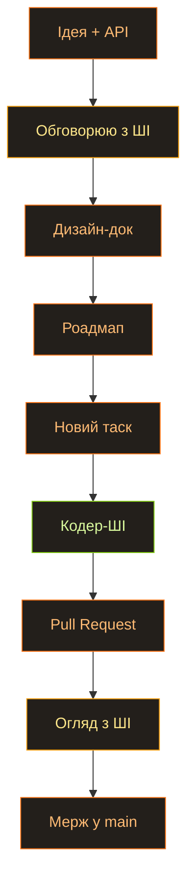

Ми з сином нещодавно передивилися «Чорнобиль» від HBO. Серіал, звісно, дико прикрашений і місцями просто вигаданий (самі лише байки про водолазів чого варті). Але навіть крізь усю драму видно, як там усе непросто влаштовано. Мене зачепило, і я пішов далі — подивився пару роликів на YouTube про те, як узагалі влаштовані й працюють електромережі. І до мене дійшло, яка ж це складна штука — тримати всю цю махину в балансі. Реально складно. Електрика для нас — просто вимикач на стіні, найзвичайнісінька річ. А щоб за тим вимикачем щось відбувалося, знадобилися десятиліття еволюції. Просто щоб у нас горіло світло й було тепло вдома.

Захотілося влізти в шкуру людей, які в усьому цьому живуть і реально розуміються. Так і народилася ідея: зробити гру про електромережі. Назвав я її [Spark](https://github.com/AlexTiTanium/spark).

## Але просто робити ігри — нудно

Просто пиляти гру мені нудно. Хочеться заразом поекспериментувати з ШІ й самому чогось навчитися. У мене вже були підходи до снаряда (движок на Rust), то чому б їх не воскресити. Перший проєкт мені свого часу набрид рівно тієї миті, коли дійшло до рендера: я вперся в купу проблем з ECS Shipyard. Її ні разу не було розраховано на те, щоб її так використовували.

## Моя геніально тупа ідея

І тут вмикається мій улюблений жанр ідей — геніально тупі, як завжди. А що, як викинути майже весь движок разом з усім його API і замінити одним-єдиним ECS? Звучить дико, знаю.

Хай усе в движку буде однією з трьох речей. Компоненти — їх багато. Ресурси — вони в єдиному екземплярі. Системи — це вся логіка. А далі найвеселіше: рендер, ассет-менеджер, камера, звук — це теж просто ресурси. І будь-яка система, якій вони потрібні, просто запитує їх за іменем. Один світ, одні правила для всього.

Раз кожна система заздалегідь каже, що читає і що пише, я можу зібрати планувальник, який розкидає непересічні таски по потоках, і все закрутиться паралельно саме собою. Власне, тому ECS у мене й став серцем движка, а не просто однією з деталей.

У коді це виглядає приблизно так. Жодного «обʼєкта движка» з методами — є `World`, і в ньому живе все:

```rust
// In Spark there is no "engine object" with methods. There is a World, and
// everything lives inside it — as a Resource (one of a kind) or an Entity
// (many of a kind). The renderer, the GPU, the input, the power grid: all
// just Resources. Nothing hidden away in global statics.

#[derive(Resource)]
struct RenderContext {
    device: wgpu::Device,
    queue: wgpu::Queue,
    surface: wgpu::Surface<'static>,
}

#[derive(Resource, Default)]
struct PowerNetwork {
    supply: f32,
    demand: f32,
    ratio: f32,
}

// A system is just a function. Its parameters declare what it touches —
// and the scheduler hands it exactly that, nothing more.
fn balance_grid(mut grid: ResMut<PowerNetwork>) {
    grid.ratio = grid.supply / grid.demand.max(1.0);
}
```

## Чому не взяти готове — Bevy чи Shipyard

Логічне питання: навіщо городити своє, якщо є [Bevy](https://github.com/bevyengine/bevy/tree/main/crates/bevy_ecs) і [Shipyard](https://github.com/leudz/shipyard). Мені дуже подобається синтаксис Bevy — він помітно логічніший за Shipyard. Але в Shipyard є ворклоадс (workloads), і ось вони зроблені чудово. І я тупо не можу вибрати.

При цьому Bevy величезний. А Shipyard — ті ще нетрі. І якщо мені знадобиться щось, чого там немає і що не підтримується, я це з жодним ШІ не витягну: я ж навіть приблизно не уявляю, як ці штуки влаштовані всередині. Що, власне, і є справжня причина всієї затії — я хочу розуміти. Хоча б на рівні структур і тих рішень, які ухвалюють автори таких бібліотек. За рахунок чого воно працює так швидко. На які компроміси вони йдуть.

Ось те саме в обох. Bevy:

```rust
// Bevy — a system is a plain function; you ask for data by its type.
fn movement(mut query: Query<(&mut Position, &Velocity)>) {
    for (mut pos, vel) in &mut query {
        pos.x += vel.x;
        pos.y += vel.y;
    }
}

let mut schedule = Schedule::default();
schedule.add_systems(movement);
```

Shipyard:

```rust
// Shipyard — a system takes "views" into storages, then iterates them.
fn movement(mut positions: ViewMut<Position>, velocities: View<Velocity>) {
    for (mut pos, vel) in (&mut positions, &velocities).iter() {
        pos.x += vel.x;
        pos.y += vel.y;
    }
}

world.run(movement);
```

А ось ті самі ворклоадс з Shipyard, які я хочу поцупити до себе. Називаєш пачку систем одним імʼям, віддаєш світу, а він сам по «вʼюхах» розуміє, які системи можна ганяти паралельно:

```rust
// Shipyard workloads — name a batch of systems, add it to the world, and it
// works out which ones can run in parallel from the views they borrow.
Workload::new("simulation")
    .with_system(movement)
    .with_system(collide)
    .add_to_world(&world)
    .unwrap();

world.run_workload("simulation").unwrap();
```

Так що Spark, по суті, обкрадає обох. Синтаксис систем — у Bevy, іменовані ворклоадс — у Shipyard:

```rust
// Spark steals from both: Bevy's function-systems, Shipyard's named workloads.
// Because every system spells out what it reads and writes, the scheduler can
// batch the ones that don't collide and run them on separate threads.
app.add_workload(Workload::PowerGrid, Schedule::FixedUpdate, |w| {
    w.add(collect_supply);                      // reads plants
    w.add(compute_demand);                      // reads cities — runs in parallel
    w.add(distribute_power).after_all_prior();  // needs both, so it waits
});
```

## Підхід не такий, як з Moku

Син теж зацікавився, може, у чомусь візьме участь. І зайти з цим проєктом я хочу з іншого боку. Якщо [Moku](https://github.com/moku-labs/core) — це історія, де на чільне місце поставлено автогенерацію коду (сказав промт — пішов дивитися серіал), то тут я хочу рівно навпаки. Залізти в код, який воно генерує. Розуміти, хоча б почасти, чому воно обирає те чи інше рішення. Як це лежить у памʼяті. І спроєктувати API, який я особисто вважаю правильним. Найпевніше, ту саму суміш Bevy і Shipyard.

Заразом цікаво подивитися, як моделі пишуть Rust. На TypeScript вони, чесно кажучи, так собі.

## Як влаштована сама розробка

Роблю поетапно, і тут є принцип, на якому все тримається. Спершу обговорюємо загальний задум — цілі, чорновий API. З розмови народжується дизайн-документ: ECS, рендер, ассет-сервер і так далі. Далі роадмап, розбитий на етапи. Заводиться таск, ШІ береться за реалізацію. Коли PR готовий, я його оглядаю, намагаюся зрозуміти, обговорюю з ШІ, щоб переконатися, що реально розумію, як і чому воно працює. Або не працює. Пропоную правки. Прийняв, мержимо, йдемо далі. План — це добре. Оманливе відчуття контролю.

Кодити будуть тільки Codex чи Claude Code — і тільки код. Усі обговорення проходять зі звичайними, не-код агентами. А важливо ось чому: агент, з яким я обговорюю рішення, не повинен нічого знати про код, лізти в нього і забивати контекст. Хай обговорює зі мною, а не лізе «лагодити» і, як водиться, ламати.



---

## Подивимося, на якому місці я зіллюся

Загалом, задум амбітний. Подивимося, де я здуюся цього разу. Минулого — це була друга реалізація рендера на WebGPU. Чи дійду далі?
